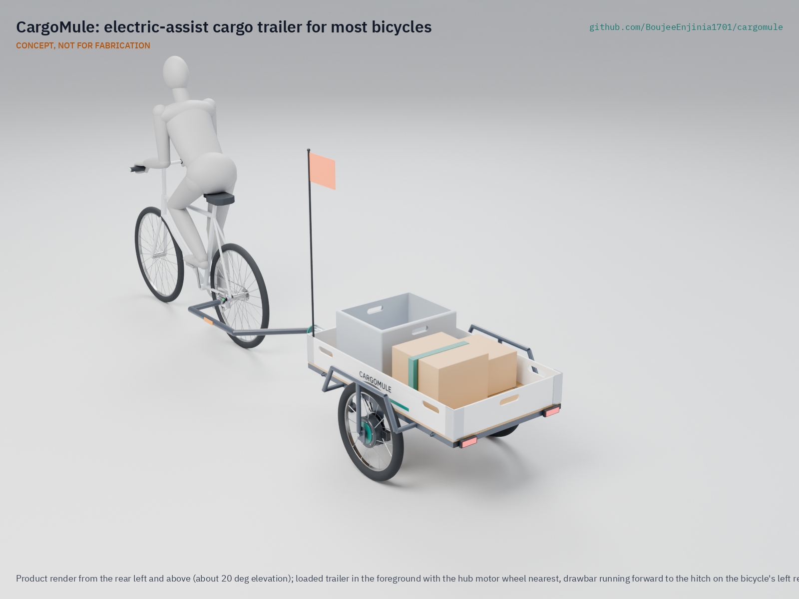
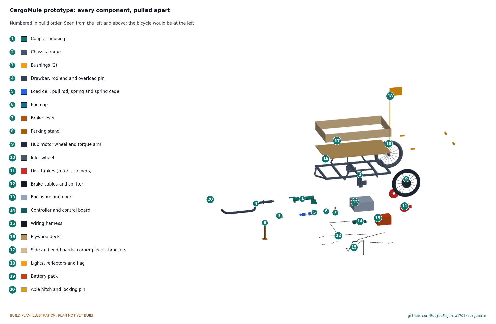

# CargoMule

     

**Area:** Mobility and Logistics · **TRL:** 3 of 9 (proof of concept on paper) · **Value-engineering target:** $1,000 USD (a hypothetical control target, not a limit) · **Difficulty:** 3 of 5

Electric-assist cargo trailer that fits most bicycles. A load cell in the drawbar measures pull force and the trailer's hub motor pushes in proportion, so the rider feels a fraction of the load.

[Exploded render](media/render-exploded.png) · [Detail render](media/render-detail.png) · [Interactive 3D model](media/viewer.html) · [Concept blueprint (PDF)](media/concept-blueprint.pdf) · [General arrangement (PDF)](cad/drawings/CGM-DWG-001.pdf) · [Calculations](docs/04-calcs/01-sizing.md) · [Prototype build plan](docs/05-build-plan.md) · [Design decisions](docs/06-design-decisions.md) · [Review note](docs/REVIEW.md)

## Concept rationale

Most of the cost and weight of a cargo e-bike sits in a special frame that only carries goods. CargoMule puts the load, the motor, the battery and the brakes on a trailer instead, so any household or business can turn the bicycle it already owns into a 150 kg carrier and unhitch it when the trip is done. Sensing pull force in the drawbar is what makes that possible: the trailer needs no sensor, cable or setting on the bike, it assists whoever is towing, and the same signal tells it when the bike is braking.

The design is open and garage-buildable because the people who need it most, traders, trades and community groups, are also the ones least able to pay for a commercial electric trailer. It uses a welded steel frame, plywood, a stock e-bike hub motor, cable disc brakes and a bought-in LiFePO4 pack, all parts a local welder and bike shop can source, fit and repair.

## Burning platform

Short urban trips with goods are still made mostly by car and van, and road vehicles are a large share of the problem. Transport produces [nearly a quarter of Europe's greenhouse gas emissions, and road transport emitted 73 % of the EU's transport emissions in 2023](https://www.eea.europa.eu/en/analysis/indicators/greenhouse-gas-emissions-from-transport) (European Environment Agency).

The same traffic fouls city air. The World Health Organization estimates that [ambient air pollution caused 4.2 million premature deaths worldwide in 2019, and that 99 % of the world's population lived where WHO air quality guideline levels were not met](https://www.who.int/news-room/fact-sheets/detail/ambient-(outdoor)-air-quality-and-health). Every van trip that a bicycle and trailer can take instead removes exhaust from exactly the streets where people live and shop.

## Where it could be used

### By industry

| Industry | Use |
| --- | --- |
| Market trading and street vending | Move a stall and 80 to 150 kg of stock between storage and the pitch each day |
| Building and garden trades | Carry tools, plants and materials to jobs within about 10 km without a van |
| Food banks and community groups | Collect and deliver donations with a trailer that hitches to any member's bike |
| Parcel and last-mile delivery | Extend an ordinary courier bike to bulky or heavy consignments on hilly rounds |
| Municipal services | Parks, litter and small maintenance crews working on paths where vans cannot go |
| Urban farming and allotments | Haul compost, harvests and water between plots and markets |

### By country or region

| Country or region | Why it matters there |
| --- | --- |
| Germany | Electric-assist cargo trailers are already sold under EU pedelec rules, but at a premium: the eCARLA starts at [€6,490](https://www.carlacargo.de/products/ecarla). An open design brings the idea to smaller users |
| Netherlands | The Dutch own about 1.3 bicycles per person and make 28 % of all journeys by bicycle, yet cargo bikes were only 2 % of new e-bike sales ([KiM Netherlands Institute for Transport Policy Analysis, *Cycling Facts 2023*](https://english.kimnet.nl/site/binaries/site-content/collections/documents/2024/01/10/cycling-facts-2023/KiM+brochure+Cycling+facts+2023_def.pdf)); an assisted trailer puts heavy loads on the bikes people already own |
| United States | A mainstream cargo e-bike such as the RadWagon 5 lists at [$2,399](https://www.radpowerbikes.com/products/radwagon-electric-cargo-bike) (Rad Power Bikes); a trailer for an existing bike is a cheaper entry, within the federal [low-speed electric bicycle definition](https://www.law.cornell.edu/uscode/text/15/2085) for the motor rating |
| India | Street vending is a recognized livelihood under the [Street Vendors Act, 2014](https://www.indiacode.nic.in/handle/123456789/2124?view_type=browse); an assisted trailer could help vendors move a stall and its stock to the pitch |
| Uganda and East Africa | A World Bank case study in eastern Uganda found bicycle traders carrying loads of around 100 kg of bananas and millet beer to market, pushing rather than riding up hills ([Malmberg Calvo, 1994](https://www.ssatp.org/sites/default/files/publication/SSATPWP12.pdf)); assist on hills and a braked trailer widen the loads a rider can move safely |
| Colombia (Bogotá) | Bogotá's 2023 mobility survey counted 886,655 bicycle trips a day, 7 % of all trips ([Secretaría Distrital de Movilidad](https://www.movilidadbogota.gov.co/en-bogota-el-70-de-los-viajes-diarios-se-realizan-en-modos-sostenibles-segun-encuesta-de-movilidad)); an assisted trailer lets those riders take on goods trips as well |

## What sparked the idea

The idea traces back to the EU-funded CycleLogistics project, whose 2013 baseline study of European cities concluded that [every second motorized trip in urban areas that involves goods transport could be shifted to the bicycle, and 42 % of all motorized trips in all](https://www.cargobike.jetzt/wp-content/uploads/2021/03/2013_cyclelogistics_baseline_study.pdf) (Reiter and Wrighton, FGM-AMOR). The study set the limit at the load a bicycle can carry, 80 to 200 kg for commercial cycles, and most of the potential it found lay in private trips such as shopping. That points at a gap: the loads are within reach of a bicycle, but most people own an ordinary bike, not a cargo bike. CargoMule is an attempt to close it with a trailer that brings the motor, battery and brakes to the bike the rider already has.

## Problem

Small businesses and households need to move 100 to 150 kg loads short distances, but cargo e-bikes are costly and ordinary bikes cannot pull that weight up hills.

## Concept

A two-wheel, 150 kg trailer hitches to the bicycle's left rear axle end with no wiring to the bike. An S-type load cell in the drawbar coupling measures pull force, and a 250 W geared hub motor in one trailer wheel pushes with four times that force (the rider can select 2 to 6), so the rider feels about 6.5 N on the flat and about 39 N on an 8 % grade. When the bike slows, the drawbar goes into compression, the motor cuts out and a mechanical overrun coupler applies disc brakes on both trailer wheels. TRL 3 calculations give about 24.5 km per charge on a hilly loaded route and an estimated parts cost of $997 against the $1,000 value-engineering target ($3 under). Made buildable, the empty trailer weighs about 46 kg, 1.2 kg over the 45 kg target for the first prototype; the response is an open decision. The hill climb (motor heating, handled by thermal derating and a stated use limit of about 300 m of continuous 8 % climbing), wet braking and hitch fit are still at risk.

Design precis: [docs/02-concept.md](docs/02-concept.md) · Calculations: [docs/04-calcs/01-sizing.md](docs/04-calcs/01-sizing.md) · Decisions: [DDR-001](docs/decisions/0001-trl2-review-decisions.md), [DDR-002](docs/decisions/0002-recommendations-accepted.md), [DDR-003](docs/decisions/0003-design-for-construction.md), [register](docs/06-design-decisions.md)

## Key components

- Welded steel trailer frame with a 1,200 x 700 mm plywood deck and wheel arch frames
- Universal axle hitch for quick-release and thru-axle bikes, with a 3.9 kN safety strap
- Bent 38 mm drawbar that clears the bike's rear tyre to 55° of yaw and slides in the coupler
- S-type load cell inside the coupler housing, with HX711-class amplifier and a 0.7 Hz assist filter
- Overrun brake coupler (spring, 7.7:1 lever, cable splitter) driving mechanical disc brakes (180 mm rotors, metallic pads) on both wheels
- 250 W, 36 V geared hub motor in one 20 in wheel, plus an idler wheel
- 36 V sine-wave motor controller (15 A pack, 30 A phase) and a microcontroller control board
- 36 V class LiFePO4 pack, 384 Wh, with BMS
- Lights, reflectors, flag and parking stand
- Battery enclosure bolted under the deck, with a lockable front door

The bill of materials is in [bom/bom.csv](bom/bom.csv). The parametric model is [cad/src/model.py](cad/src/model.py), with STEP files in `cad/step/` and the general arrangement drawing CGM-DWG-001 in `cad/drawings/`.

## Building the prototype

The [prototype build plan](docs/05-build-plan.md) (CGM-BLD-001) shows, in pictures, how to make each of the twenty components and put them together in sixteen steps; nothing has been built yet. The made parts are a steel coupler housing and spring cage, a welded box-section frame with dropout plates and arch frames, a bent drawbar, a brake lever, a parking stand, a plywood deck and boards with aluminium fittings, and a folded steel battery enclosure; the wheels, brakes, load cell, battery and electronics are bought. Writing the plan made the design buildable: the load cell now sits inside the coupler housing so the drawbar's weight goes through bushings, the coupler can be assembled in one order, the enclosure has a door and hangs from two crossmembers, and every part has a fixing (CGM-DDR-003, open for Amish's review). The constructable trailer weighs about 46 kg, over the 45 kg target; the open decisions are in the [design decisions register](docs/06-design-decisions.md).

## Safety

> **Safety:** Use the trailer on private ground only until a written legal check of electrically assisted trailers exists for your country. The trailer must brake itself: at 150 kg it is well above the 45 to 60 kg limits for unbraked cycle trailers in ASTM F1975 and EN 15918. The controller must cut assist whenever the drawbar goes into compression, at standstill, above 25 km/h and on any sensor fault. Use a hitch with a secondary safety strap rated 3.9 kN or more, and keep the load centered on the marked zone so the drawbar never lifts. The trailer contains a lithium (LiFePO4) battery pack: use a BMS with cell-level protection, fuse the pack, and charge on a non-combustible surface. See the safety section of the [design precis](docs/02-concept.md).

## Repository layout

| Folder | Contents |
| --- | --- |
| `docs/` | Problem, concept, requirements, calculations and design decisions |
| `cad/src/` | build123d Python source, the source of truth for all geometry |
| `cad/step/`, `cad/stl/` | Exported models for FreeCAD, other CAD tools and printing |
| `cad/drawings/` | 2D sketches and dimensioned drawings |
| `bom/` | Bill of materials |
| `electronics/` | KiCad schematics and PCB layouts |
| `firmware/` | Microcontroller code |
| `media/` | Renders, perspectives and photos |
| `build-log/` | Dated prototyping notes |

## Documentation

Controlled documents follow the portfolio [documentation standard](.kit/STANDARDS.md). Each carries a document ID (CGM-PRC-001 for the precis), a version and a revision history. Branded PDFs are built with `python .kit/render.py` and attached to GitHub Releases when a document is tagged, for example `CGM-PRC-001/v1.0`.

## Credits

Designed by Amish Chadha. See [CONTRIBUTORS.md](CONTRIBUTORS.md) for roles. To cite this design, use [CITATION.cff](CITATION.cff) (GitHub shows it as "Cite this repository").

AI assistance (Claude) was used to accelerate concept renders, prototype documentation and first-pass sizing calculations. Design direction and all decisions are Amish Chadha's, recorded in this repository's decision records (`docs/decisions/`).

## Licenses

- **Hardware** (CAD, drawings, BOM, electronics): [CERN-OHL-S v2](LICENSE)
- **Software** (firmware, scripts, notebooks): [MIT](LICENSE-SOFTWARE)

A project of the [Design Molecule](https://designmolecule.com) lab.
