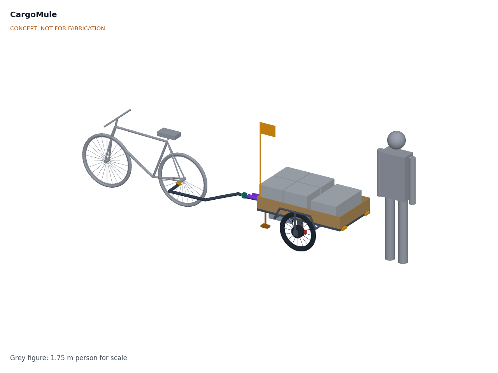

# CargoMule

  

**Area:** Mobility and Logistics · **TRL:** 3 of 9 (proof of concept on paper) · **Prototype budget:** $1,000 USD · **Difficulty:** 3 of 5

Electric-assist cargo trailer that fits most bicycles. A load cell in the drawbar measures pull force and the trailer's hub motor pushes in proportion, so the rider feels a fraction of the load.

[Interactive 3D model](media/viewer.html) · [Concept blueprint (PDF)](media/concept-blueprint.pdf) · [General arrangement (PDF)](cad/drawings/CGM-DWG-001.pdf) · [Calculations](docs/04-calcs/01-sizing.md) · [Review note](docs/REVIEW.md)

## Problem

Small businesses and households need to move 100 to 150 kg loads short distances, but cargo e-bikes are costly and ordinary bikes cannot pull that weight up hills.

## Concept

A two-wheel, 150 kg trailer hitches to the bicycle's left rear axle end with no wiring to the bike. An S-type load cell in the drawbar coupling measures pull force, and a 250 W geared hub motor in one trailer wheel pushes with four times that force (the rider can select 2 to 6), so the rider feels about 6.5 N on the flat and about 37 N on an 8 % grade. When the bike slows, the drawbar goes into compression, the motor cuts out and a mechanical overrun coupler applies disc brakes on both trailer wheels. TRL 3 calculations give about 25 km per charge on a hilly loaded route and parts costing $969 against the $1,000 budget. The empty trailer weighs about 43 kg, over the 40 kg target, and the hill climb (motor heating), wet braking and hitch fit are at risk.

Design precis: [docs/02-concept.md](docs/02-concept.md) · Calculations: [docs/04-calcs/01-sizing.md](docs/04-calcs/01-sizing.md) · Decisions: [docs/decisions/0001-trl2-review-decisions.md](docs/decisions/0001-trl2-review-decisions.md)

## Key components

- Welded steel trailer frame with a 1,200 x 700 mm plywood deck and wheel arch frames
- Universal axle hitch for quick-release and thru-axle bikes, with a 3.8 kN safety strap
- Offset 38 mm drawbar that clears the bike's rear tyre to 55° of yaw
- Drawbar S-type load cell with HX711-class amplifier and a 0.7 Hz assist filter
- Overrun brake coupler driving mechanical disc brakes on both wheels
- 250 W, 36 V geared hub motor in one 20 in wheel, plus an idler wheel
- 36 V sine-wave motor controller (15 A pack, 30 A phase) and a microcontroller control board
- 36 V class LiFePO4 pack, 384 Wh, with BMS
- Lights, reflectors, flag and parking stand

The bill of materials is in [bom/bom.csv](bom/bom.csv). The parametric model is [cad/src/model.py](cad/src/model.py), with STEP files in `cad/step/` and the general arrangement drawing CGM-DWG-001 in `cad/drawings/`.

## Safety

> **Safety:** Check local rules for electrically assisted trailers before riding on public roads. The trailer must brake itself: at 150 kg it is well above the 45 to 60 kg limits for unbraked cycle trailers in ASTM F1975 and EN 15918. The controller must cut assist whenever the drawbar goes into compression, at standstill, above 25 km/h and on any sensor fault. Use a hitch with a secondary safety strap rated 3.8 kN or more, and keep the load centered on the marked zone so the drawbar never lifts. The trailer contains a lithium (LiFePO4) battery pack: use a BMS with cell-level protection, fuse the pack, and charge on a non-combustible surface. See the safety section of the [design precis](docs/02-concept.md).

## Repository layout

| Folder | Contents |
| --- | --- |
| `docs/` | Problem, concept, requirements, calculations and design decisions |
| `cad/src/` | build123d Python source, the source of truth for all geometry |
| `cad/step/`, `cad/stl/` | Exported models for FreeCAD, other CAD tools and printing |
| `cad/drawings/` | 2D sketches and dimensioned drawings |
| `bom/` | Bill of materials |
| `electronics/` | KiCad schematics and PCB layouts |
| `firmware/` | Microcontroller code |
| `media/` | Renders, perspectives and photos |
| `build-log/` | Dated prototyping notes |

## Documentation

Controlled documents follow the portfolio [documentation standard](.kit/STANDARDS.md). Each carries a document ID (CGM-PRC-001 for the precis), a version and a revision history. Branded PDFs are built with `python .kit/render.py` and attached to GitHub Releases when a document is tagged, for example `CGM-PRC-001/v1.0`.

## Licenses

- **Hardware** (CAD, drawings, BOM, electronics): [CERN-OHL-S v2](LICENSE)
- **Software** (firmware, scripts, notebooks): [MIT](LICENSE-SOFTWARE)

Part of the open hardware portfolio at [amishchadha.com](https://amishchadha.com).
