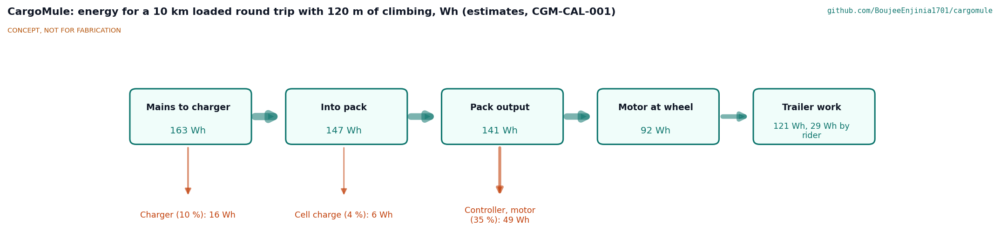
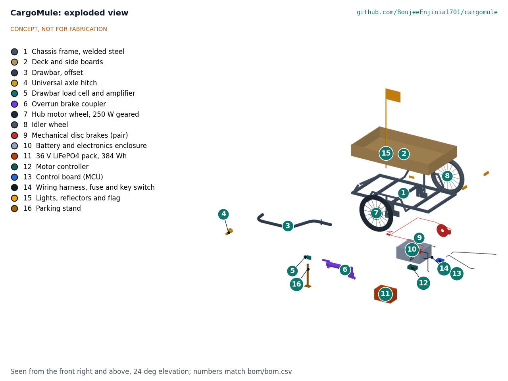
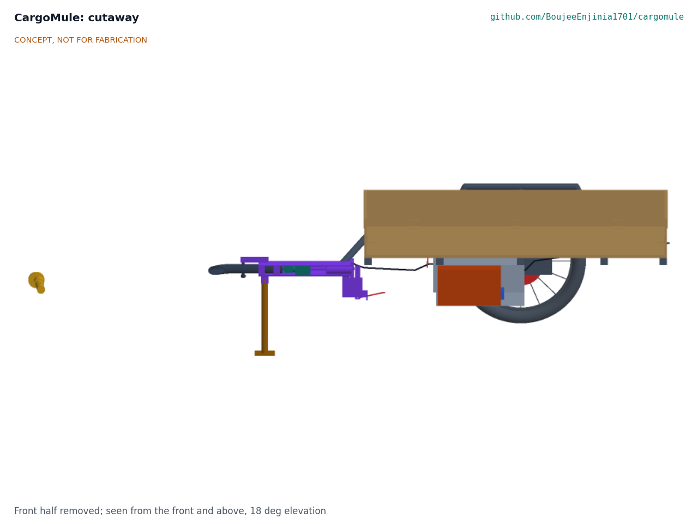

# CargoMule design precis

CargoMule is a two-wheel, 150 kg cargo trailer that hitches to a bicycle's rear axle and pushes itself. A load cell inside the drawbar coupling measures how hard the bicycle pulls, a small controller commands a 250 W geared hub motor in one trailer wheel to push with four times that force, and the rider feels a fraction of the trailer's load. When the bicycle slows, the drawbar goes into compression: the controller cuts the motor and a mechanical overrun coupler applies disc brakes on both trailer wheels. TRL 3 calculations (CGM-CAL-001 v0.3) give about 24.5 km per charge of a 384 Wh LiFePO4 pack on a hilly loaded route, about 6.5 N of felt pull on the flat and about 39 N on an 8 % grade, and parts costing $997 against the $1,000 budget. Made buildable (CGM-DDR-003, build plan CGM-BLD-001), the empty trailer weighs about 46.2 kg, 1.2 kg over the 45 kg target Amish set for the first prototype (R8, CGM-DDR-002); the response is proposed to him. The hill climb, braking and hitch fit are still at risk (R3, R6, R7).

*Figure 1. CargoMule hitched to an ordinary bicycle with a 150 kg load, and a 1.75 m person for scale. Trailer parts are colored; the bicycle and load are grey. Generated from the parametric model; not for fabrication.*

## How it works

1. **Hitch.** A universal hitch clamps under the bicycle's left rear axle end (quick release or thru-axle) and joins the drawbar through a joint that allows pitch, yaw and roll, so the bike can lean and turn freely. Nothing else attaches to the bike and there is no cable. The drawbar runs out 360 mm to the left before turning in, so it clears the bike's rear tyre up to 55° of yaw.
2. **Sense.** Near the trailer, the drawbar runs straight along the center line and slides in two bushings in the coupler housing, a steel tube at the frame's nose. The bushings carry bending and the tongue load; inside the housing the axial force passes through an S-type load cell and a pull rod to a bulkhead, so the cell reads only pull (tension) or push (compression). A pin through the drawbar rides in a slot on the housing: it stops the drawbar turning and, 0.5 mm from the slot's end, is the cell's overload stop. A 24-bit amplifier (HX711 class) samples at 80 Hz.
3. **Decide.** The control board filters the signal with a second-order 0.7 Hz low-pass to remove the pulse of each pedal stroke and road bumps, then sets motor force to a gain G times the measured pull above a 3 N deadband. The rider selects G from 2 to 6 on the trailer; with the default G = 4 the rider supplies about 1/(1 + G), or 20 %, of the force needed to move the trailer. The board also reads wheel speed from the motor's Hall sensors and a key switch. A firmware rule derates motor current on a winding temperature estimate so the winding stays at or below 100 °C on long climbs (CGM-DDR-002).
4. **Push.** A 36 V sine-wave controller (15 A pack and 30 A phase current limits, torque-mode input) drives a 250 W geared hub motor laced into the left 20 in wheel. The right wheel is an idler. Assist stops above 25 km/h, when the trailer stands still and whenever the drawbar is not in tension.
5. **Brake.** When the bicycle brakes, the trailer's momentum pushes the drawbar into compression. A fast path on the raw load cell signal zeroes the motor within about 60 ms once compression passes 20 N. Beyond a 30 N preload, the drawbar, load cell and pull rod slide back against a spring, and the pull rod's tail pushes a 7.7:1 lever (with friction damping on its pivot) that pulls cables to mechanical disc brakes with 180 mm rotors and metallic pads on both wheels, as in a car trailer's overrun brake. The brakes work with the electronics off or failed.
6. **Store and charge.** A 12S LiFePO4 pack (38.4 V nominal, 10 Ah, 384 Wh) with its own BMS sits in a closed steel enclosure hung under the deck between two crossmembers, beside the controller and control board; it slides out through a lockable front door. It charges from a 43.8 V, 4 A charger off the trailer in about 3 h.

Sensing force at the drawbar is what lets CargoMule fit most bicycles without wiring: it does not need to know how hard the rider pedals, only how hard the bike pulls. It also detects braking, since a pushing drawbar means the bike is slowing.

*Figure 2. Energy for one 10 km loaded round trip with 120 m of climbing and 20 stops, in Wh (CGM-CAL-001, E6). All values are estimates.*

## Main components

Numbers match the exploded view (Figure 3) and `bom/bom.csv`. The general arrangement is drawing CGM-DWG-001 (`cad/drawings/CGM-DWG-001.pdf`), generated from `cad/src/model.py`.

Table 1. Main components.

| # | Component | Choice | Notes |
| --- | --- | --- | --- |
| 1 | Chassis frame | Welded mild steel: 30 x 30 x 1.5 mm box perimeter and three crossmembers, A-frame nose, wheel arch frames carrying the outer dropouts, dropouts for 100 mm hubs | Steel (CGM-DDR-001, D3); about 12.4 kg |
| 2 | Deck and side boards | 12 mm exterior plywood deck, 1,200 x 700 mm; removable 9 mm side boards, 150 mm high | Tie-down eyes on the frame |
| 3 | Drawbar | S355 tube 38 x 2.5 mm, bent in three 115 mm radius bends, offset 360 mm left of the center line, straight rear part sliding in the coupler | Upsized from 32 x 2 mm for the offset |
| 4 | Universal axle hitch | Plate under the axle end with a three-axis joint, lock indicator and a secondary strap rated 3.9 kN or more | QR and thru-axle adapters |
| 5 | Drawbar load cell and amplifier | S-type cell, 1 kN (100 kg) range, inside the coupler housing on a clevis and pull rod, overload stop, HX711-class amplifier | Reads axial force only |
| 6 | Overrun brake coupler | Steel housing welded into the frame nose, two bushings, spring cage and end cap, 50 mm stroke, 30 N preload, 7.7:1 lever with friction damping, cable splitter | Mechanical; works with power off |
| 7 | Hub motor wheel | 36 V, 250 W geared front-style hub, about 230 rpm winding, 20 in (ETRTO 406) wheel, disc mount | Left side (CGM-DDR-001, D4) |
| 8 | Idler wheel | 20 in wheel with a 100 mm disc hub, salvaged or budget grade | Right side |
| 9 | Mechanical disc brakes | Two budget cable calipers, 180 mm rotors, metallic (sintered) pads | Actuated by item 6; 180 mm per CGM-DDR-002 (was 160 mm) |
| 10 | Battery and electronics enclosure | Folded 0.8 mm galvanized steel, 350 x 300 x 170 mm, vented, lockable front door | Bolted under two crossmembers; 208 mm ground clearance |
| 11 | Battery pack | 12S1P LiFePO4, 38.4 V, 10 Ah, 384 Wh, with BMS | 36 V LFP (CGM-DDR-001, D2) |
| 12 | Motor controller | 36 V sine wave, 15 A pack and 30 A phase limits, torque-mode input, IP65 | Commanded by item 13 |
| 13 | Control board | Microcontroller, load cell input, Hall speed input, key switch, gain selector, status LED | Firmware is a TRL 3 sketch at most |
| 14 | Wiring harness | Keyed waterproof connectors, 20 A fuse, key switch | |
| 15 | Lights, reflectors and flag | Rear red lights powered from the pack, side reflectors, flag on a pole at the front left corner, top at 1,570 mm | |
| 16 | Parking stand | Leg pivoted under the coupler housing, folds back | Holds the coupler level when unhitched |

*Figure 3. Exploded view with numbered callouts matching the BOM.*

*Figure 4. Section on the trailer's center line, showing the pack, controller and control board in the enclosure under the deck, and the load cell and overrun coupler on the drawbar.*

## Checked numbers

All values come from CGM-CAL-001 and its script `docs/04-calcs/sizing.py`; the tag in brackets is the script line. Assumptions are listed there and in CGM-REQ-001.

### Mass and balance

Table 2. Mass and balance.

| Group | Value |
| --- | --- |
| Frame 13.0 kg, deck, boards and fittings 8.9 kg, drawbar, hitch, load cell and coupler 6.9 kg, stand 0.6 kg | 29.4 kg |
| Wheels, motor, torque arm and brakes | 7.3 kg |
| Enclosure, pack, controller, board, harness | 8.3 kg |
| Lights, flag, hardware and paint | 1.3 kg |
| **Empty trailer** | **46.2 kg (102 lb) [A3]; R8 (45 kg) not met** |
| Loaded trailer, design case | 196.2 kg [A4] |
| Hitch down load, payload centered | 7.5 kg [A6]; axle 20 mm behind the deck center; R10 met |
| Loading window for 3 to 10 kg on the hitch | payload center 32 mm ahead to 57 mm behind the deck center [A7] |
| Static rollover threshold | 0.77 g on the 800 mm track [A8] |

Without the side boards the trailer weighs 43.4 kg. Amish decided on 2026-09-25 to relax R8 to 45 kg for the first prototype, keep the steel frame (CGM-DDR-001, D3) and hold straps or mesh in place of the side boards as a later weight option (CGM-DDR-002). Making the design buildable added 3.0 kg (CGM-DDR-003), mostly in the coupler; the response to the new miss is proposed to Amish there (A1).

### Forces, motor and heating

Table 3. Drawbar forces with G = 4 and a 3 N deadband.

| Case | Trailer resistance | Motor force | Felt by rider | Motor | Requirement |
| --- | --- | --- | --- | --- | --- |
| Flat, 5 to 20 km/h | 19.4 to 21.1 N | 13.1 to 14.5 N | 6.3 to 6.6 N [B1] | | R4 (15 N) met |
| 8 % grade at 8 km/h | 173.6 N [B2] | 134.9 N | 38.7 N [C3] | 300 W, 24.3 A phase, 15.0 A pack [C2] | R3 force (40 N) met |
| Same grade, no assist | 173.6 N | 0 | 173.6 N, 386 W extra | | Why assist is needed |

The motor runs at about 55 % efficiency on the climb, so it loses about 247 W. After flat cruising the winding sits near 52 °C; the 300 m design climb brings it to about 96 °C against a 100 °C limit, and a 1,000 m climb would reach about 175 °C [C6]. R3 is therefore at risk. Amish decided to keep the 250 W motor, add thermal derating and state a use limit (CGM-DDR-002): at full assist the winding reaches 100 °C after about 331 m of 8 % climbing, after which the firmware holds it there by cutting current, and the felt pull rises toward about 117 N on a climb that never ends [C10]. The rider instructions state a use limit of about 300 m of continuous 8 % climbing with full assist. The motor constants still need a datasheet, which comes with part selection at TRL 4 (on hold). The result also depends on the controller: with a 12 A pack limit the rider would feel 59 N [C4]. Assisted or not, the rider still lifts their own bike and body; at 150 W a rider climbs the 8 % grade at about 4.4 km/h [C5].

The motor drives only the left wheel, so on the climb it applies a yaw moment of about 135 N x 0.40 m, about 54 N·m, reacted mostly by the tyres. This should be small in practice but is unverified for handling on gravel or in the wet.

### Assist loop stability

The drawbar, hitch joint and load cell act as a spring between the bike and the trailer, and the motor feeds the measured pull back with a delay of about 39 ms [D1]. The TRL 2 filter (first order, 2 Hz) makes this loop oscillate above G = 0.5 at the softest stiffness considered. A second-order 0.7 Hz filter is stable for G = 2 to 6 across drawbar stiffnesses of 20 to 500 N/mm, with a gain margin of 2.9 (9.3 dB) at G = 4 and 2.0 (5.8 dB) at G = 6 [D3]. Amish decided to keep 2 to 6 on paper and to settle the top setting once the hitch joint stiffness is measured, which is TRL 4 work and on hold (CGM-DDR-002). The price is a slower assist: about 0.47 s to reach 90 % after a step in pull [D4]. The compression cut does not wait for the filter; it acts on the raw signal in about 60 ms [D6].

### Energy and range

Table 4. Energy on the design route (10 km, 120 m up and down, 20 stops).

| Quantity | Value | Basis |
| --- | --- | --- |
| Flat, 5.2 km at 18 km/h | 27 Wh from the pack | [E1] |
| Climbs, 2.4 km at 5 % and 10 km/h | 96 Wh | [E1]; motor at low efficiency |
| Descents, 2.4 km | 0 Wh | Overrun brake holds speed |
| Stops, 20 from 18 km/h | 18 Wh | [E2] |
| **Pack energy per km** | **14.1 Wh/km** | [E3] |
| Usable pack energy | 346 Wh | 384 Wh x 90 % |
| **Range on the design route** | **24.5 km** | R2 (20 km) met [E3] |
| Range on flat roads, few stops | about 61 km | 5.7 Wh/km [E4] |
| Mains energy per 10 km trip | 163 Wh | Figure 2 [E6] |
| Charge time, empty to full | about 3 h | 10 Ah at 4 A plus the constant-voltage phase [E7] |

### Braking

At 20 km/h the loaded trailer carries 3.03 kJ of kinetic energy, about twice the bicycle and rider (1.54 kJ). For the combination to slow at 3 m/s², the trailer needs 589 N of braking force; with the bike taking at most 100 N of push, the trailer brakes must give 489 N [F1]. Amish decided on 2026-09-25 to fit 180 mm rotors with metallic pads (CGM-DDR-002). With the same overrun coupler (30 N preload, 7.7:1 lever, 27 mm of its 50 mm stroke used to take up clearance) the brake gain rises from 6.9 to 7.8, so the push is 93 N with dry pads [F3] and about 111 N with wet pads, against 121 N with 160 mm rotors [F4]. R6 is improved but still at risk in the wet. Stopping distance from 20 km/h is 10.7 m with a 1 s reaction [F5]. On a long 8 % descent at 20 km/h the rider feels about 42 N of push and each rotor absorbs about 258 W, tending to a temperature rise of about 131 K; on 10 % at 25 km/h this becomes about 225 K [F6]. A descent speed limit is still needed.

### Structure and fit

- Side rails: 149 MPa at a 2 g bump, a factor of 1.6 on S235 [G1]. Drawbar: a factor of 4.3 at a 3 g tongue load, taken at the coupler's front bushing, and 1.6 in the ultimate hitch case of 1,925 N [G3], [G4]. Hitch axle: factors of 2.4 (QR) and 3.8 (thru-axle); safety strap 3.9 kN or more [G6]. Deck: 8.4 MPa under a 75 kg point load against 10 MPa allowable [G7].
- Overall 960 mm wide (972 mm over the motor cable clipped outside the left arch) and 2.52 m long from the bike axle [H2]; tyre to side rail 22.5 mm [H3]; articulation 55.5° toward the drawbar side and 105.5° away from it [H5], enough for steady turns down to about 1.3 m radius [H6].

### Cost

Table 5. Parts cost from `bom/bom.csv` (CGM-CAL-001, I1).

| Group | Items | Cost |
| --- | --- | --- |
| Structure | 1 to 4, 16 | $272 |
| Sensing and braking | 5, 6, 9 | $135 |
| Drive | 7, 8, 12 | $225 |
| Energy and control | 10, 11, 13, 14, 17 | $305 |
| Lights and hardware | 15, 18 | $60 |
| **Total** | | **$997; R12 ($1,000) met** |

The D1 cost cuts (salvaged or budget idler wheel, budget calipers, smaller enclosure) save $50; the TRL 3 changes (arch frames, repriced plywood, the larger offset drawbar, a stronger hitch strap, the coupler lever and the load cell overload stop) add $54. The 180 mm rotors and metallic pads of CGM-DDR-002 add $10, and the fittings and coupler parts of CGM-DDR-003 add $18.

## Key design choices

Amish decided the choices below on 2026-09-25 (CGM-DDR-001 and CGM-DDR-002), in each case going with the recommendation.

- **Force sensing at the drawbar (D8).** No sensor on the bike, works with most bikes and riders, and detects braking. Alternatives were a crank sensor on the bike or wheel-speed matching.
- **Control law (D5).** Proportional assist, motor force = G x measured pull, with a rider-selectable gain of 2 to 6 and a default of 4. TRL 3 adds the 0.7 Hz second-order filter and the 3 N deadband that keep this loop stable and quiet.
- **One hub motor in the left wheel (D4).** Cheapest, one controller, small yaw moment.
- **Overrun mechanical brake plus assist cut (D6).** Works unpowered; known from car trailers and Carla Cargo.
- **Battery (D2).** A 12S 36 V class LiFePO4 pack, 384 Wh. A SwapCell receiver is a later fleet variant; it would build to SwapCell interface v0.3 (wake without CAN, charge while discharging, vehicle latch vibration rating), and the shared pack would be priced once and left out of this kit's budget.
- **Frame material (D3) and mass target (DDR-002).** Welded mild steel for the first prototype, with R8 relaxed to 40 kg and then to 45 kg. The constructable trailer weighs 46.2 kg (CGM-DDR-003); the response is proposed to Amish. Straps or mesh in place of the side boards are a later weight option.
- **Long climbs (DDR-002).** Keep the 250 W motor, derate current on winding temperature and state a use limit of about 300 m of continuous 8 % climbing.
- **Brakes (DDR-002).** 180 mm rotors with metallic pads on both wheels, with the 7.7:1 coupler lever kept.
- **Gain range (DDR-002).** Keep G = 2 to 6 on paper; settle the top setting when the hitch joint stiffness is measured (TRL 4, on hold).
- **20 in wheels and a hitch on the left axle end (D9).** Small wheels keep the deck low (420 mm) and the drawbar near level with a 700c or 26 in bike's axle; the left side keeps clear of the derailleur.
- **Budget (D1).** Cost cuts first, then `budget_usd` raised to $1,000.
- **Handcart mode (D10).** Out of scope for now.

Still open, with no recommendation: the first users and region for co-design (O1) and the legal status of a motorized trailer on public roads (O2). Every open decision is listed in the design decisions register, CGM-DEC-001 (`docs/06-design-decisions.md`).

## Safety

> **Safety:** CargoMule is a 196 kg moving load behind a bicycle, driven by a motor and powered by a lithium battery. Braking, hitch failure, runaway assist, motor and brake heat, and battery fire are the main hazards, and each must be designed out before any ride.

- **Runaway or unintended push.** A motor that pushes when the bike slows can shove the bike into traffic or jackknife it. Assist only while the drawbar is in tension above the 3 N deadband; zero motor current within 100 ms of compression above 20 N (about 60 ms on paper, on the raw signal), above 25 km/h, at standstill, on any load cell fault (open or short, out of range, stuck value, failed plausibility check against speed) and when the key is off. The controller must run in torque mode with its own current limit, so a firmware fault cannot command more than the rated force. No throttle.
- **Assist oscillation.** With the TRL 2 filter the assist loop would oscillate and could pump the drawbar. The 0.7 Hz second-order filter is required, and gains above 6 must not be selectable.
- **Braking and jackknife.** The loaded trailer has about twice the kinetic energy of the bicycle and rider. Trailer brakes are mandatory above the 45 to 60 kg limits in ASTM F1975 and EN 15918, and the overrun brake must work with the power off. With the 180 mm rotors and metallic pads, wet pads still raise the push on the bike to about 110 N, and long, steep descents can heat rotors by 130 to 220 K; limit descent speed.
- **Hitch failure.** A detached 196 kg trailer is a serious hazard to others. The hitch needs a secondary safety strap rated 3.9 kN or more, a clear locking indicator and a design load above the 1,925 N ultimate case.
- **Load placement.** The hitch load swings by 7.8 kg per 100 mm of payload shift, and the drawbar unloads with the payload center 96 mm behind the deck center. Mark the loading zone on the deck and strap loads down; a lifting drawbar makes the trailer unstable.
- **Motor heat.** Climbs longer than about 300 m at 8 % can overheat the motor; the firmware derates current on a winding temperature estimate, and the use limit is stated to riders. Assist fades rather than stops, so the rider must be ready to carry more of the load near the top of a long climb. The left rotor sits on the motor, so brake heat also reaches it.
- **Lithium battery.** A 384 Wh LiFePO4 pack is less prone to thermal runaway than other lithium-ion chemistries, but a short circuit can still start a fire. Use a BMS with cell-level protection and low-temperature charge cutoff, a 20 A fuse at the pack, a closed steel enclosure with a vent directed away from the load, and charge on a non-combustible surface away from sleeping areas. Never charge a damaged or wet pack.
- **Mains charging.** The charger is a certified off-the-shelf unit; no mains wiring is built into the trailer.
- **Tipping.** The static rollover threshold is 0.77 g with the design load; a high or off-center load lowers it. Keep loads low and centered.
- **Pinch points and sharp edges.** The drawbar slides 50 mm into the coupler under load, the brake lever swings under the housing and the parking stand folds; keep fingers out of the fork slot, the side window and the lever cheeks (the window has a rubber cover). Deburr all frame edges and fit end caps to open tube ends. The tyres run 22.5 mm from the side rails.
- **Visibility.** A long, wide combination is easy to misjudge; lights, reflectors and a flag are part of the design, not accessories.

## Open questions

TRL 4 is on hold by Amish's instruction. These questions remain at TRL 3:

- Legal status of a motorized bicycle trailer in the first target country (CGM-DDR-001, O2); first users and region (O1).
- Motor constants (winding, resistance, thermal) from a real datasheet, which decide whether R3 holds (decided, CGM-DDR-002; comes with part selection at TRL 4, on hold).
- Stiffness and damping of the hitch joint, which set the real loop margin and the top gain setting (TRL 4 measurement, on hold).
- Wet braking on long descents (R6): about 111 N of push remains with 180 mm rotors; wet pad friction data or a higher lever ratio would close the gap.
- Hitch axles for each thru-axle thread and length, and adapters for nutted axles (R7).
- Yaw effect of driving one wheel, especially on gravel or in the wet.
- Freedom to operate against coupling-sensor patents such as WO2022223692A1.

Concept media: [blueprint sheet](../media/concept-blueprint.pdf), [interactive 3D model](../media/viewer.html). General arrangement: [CGM-DWG-001](../cad/drawings/CGM-DWG-001.pdf). Prototype build plan: [CGM-BLD-001](05-build-plan.md).
