# CargoMule prototype build plan

**Plan, not yet built.** How to build the first proof-of-concept prototype, component by component. Building and testing to it is TRL 4 work. Decisions still to be made are kept in the design decisions register ([docs/06-design-decisions.md](06-design-decisions.md)), not here.

## 1. What you are building

*Figure 1. Every component pulled apart and numbered in build order, seen from the left; the bicycle would be on the left.*

The prototype is one CargoMule trailer: a welded steel frame on two 20 in wheels with a plywood deck 1,200 x 700 mm and removable side boards, towed from a bicycle's left rear axle end by a bent steel drawbar. The drawbar's straight rear end slides in a steel tube at the frame's nose, the coupler housing. Inside the housing a load cell measures how hard the bike pulls, and a hub motor in the left wheel pushes in proportion. When the bike slows, the drawbar slides back against a spring and a lever pulls the disc brakes on both wheels. A battery pack, motor controller and control board sit in a steel box under the deck. Figure 1 shows the 20 components in the order you make or fit them. Ten are made in a workshop: the coupler housing, the spring cage and end cap, the dropout plates, the frame, the drawbar, the brake lever, the parking stand, the deck, the boards with their fittings, and the battery enclosure. Everything else is bought and fitted. The work is sawing, drilling, filing and welding steel tube and plate, bending one tube in a tube bender, folding thin sheet, cutting plywood, and wiring bought electrical parts with plug-in connectors. The parts cost about $997 from the bill of materials.

> **Safety:** This trailer carries 150 kg behind a bicycle, has a 384 Wh lithium iron phosphate battery and a motor that pushes, and brakes itself with a spring-loaded coupler. Welding, grinding and tube bending need eye, hand and hearing protection and a fire-safe area. The battery stays out of the workshop until stop S3 in section 6, and the trailer is never ridden or towed on a public road as part of this plan. The first loaded tests happen only after every stop in section 6 is passed.

## 2. What changed to make it buildable

The concept showed what the trailer does; some of its parts could not be made, fixed or put together as drawn. Each change below keeps what the trailer does, and all of them are recorded in decision record CGM-DDR-003, open for Amish's review.

*Table 1. Changes from the concept.*

| Component | The concept had | The buildable design has | Why |
| --- | --- | --- | --- |
| Load cell and coupler | A load cell on pinned ends in the drawbar line, ahead of a separate sliding coupler  | The drawbar slides in two bushings in the coupler housing; the load cell is inside the housing, in line with a pull rod and a spring (Figure 5) | A pinned load cell cannot hold the drawbar up; the bushings now carry its weight and bending, and the cell sees only pull and push |
| Assembly of the coupler | Parts that could not be put in from either end | The spring, rod and cell go in from the rear as one cartridge; a pin joins them to the drawbar through a side window (Figure 6) | Every part goes in and comes out with hand tools |
| Overload stop | None that could be built | A closed slot on top of the housing; a pin through the drawbar sits 0.5 mm behind its end (Figure 3) | It also stops the bent drawbar turning in its bushings |
| Brake lever | A block with no pivot | A lever on a bolt between two plates under the housing, 7.7 to 1, with friction washers for damping (Figure 15) | Same ratio as the concept; nothing else to mount |
| Drawbar | Sharp corners and a short straight end | One tube with three bends made in a tube bender (Figure 12) | A fabricator can bend it in one piece |
| Nose of the frame | Nose bars meeting in a solid ball | Nose bars welded to the sides of the coupler housing (Figure 11) | The housing is the nose |
| Battery enclosure | An open box with a lid it could not open, no fixing | A closed box bolted up into two crossmembers, with a front door the pack slides out of (Figure 22) | The pack can be fitted and removed; the box hangs from the frame |
| Brakes and dropouts | Calipers running into the motor; no axle slots; no torque arm | Calipers on tabs of the inner dropout plates, slotted dropouts and a torque arm (Figure 8) | Standard bicycle parts fit |
| Deck, boards, lights, flag, stand | No fixings | Bolts into rivet nuts, wing-nut brackets, pole clips and a pivoted stand (Figure 20) | Everything is held, and the boards still come off by hand |

The constructable trailer weighs 46.2 kg empty, 3.0 kg more than the concept estimate, mostly in the coupler and the fixings.

## 3. Making the components

Make and check each component before the assembly step that needs it. Sizes are in millimetres. "Front" is toward the bicycle, "left" and "right" are as seen sitting on the bicycle, and heights are above the ground with the trailer on its wheels. Workshop tolerance is 0.5 mm unless a step says otherwise; drawings do not carry tolerances before TRL 4.

### 3.1 Coupler housing

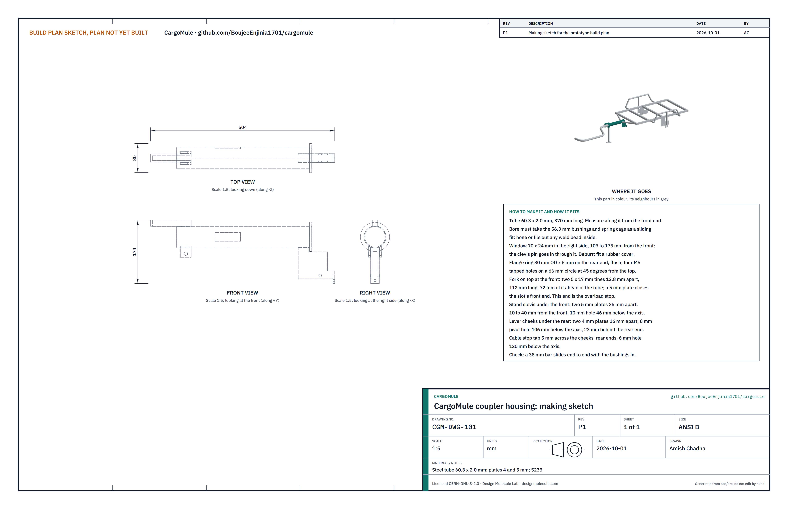

*Figure 2. Coupler housing making sketch (CGM-DWG-101).*

**What it is and what it is made from.** The steel tube at the front of the frame that the drawbar slides in, with the load cell inside it, and the brackets that carry the brake lever and the parking stand. Steel tube 60.3 mm outside, 2.0 mm wall, with 4 and 5 mm steel plate brackets, S235 class.

**How to make it.**

1. Cut 370 mm of 60.3 x 2.0 mm tube, square. Mark a line along the top. All positions below are measured from the front end.
2. Check the bore with a 56.3 mm plug gauge or a bushing: it must slide end to end. File or hone out any seam bead.
3. Window: mark a 70 x 24 mm window on the right side, centred on the tube's side, from 105 to 175 mm. Chain drill and file it, and round its corners. The clevis pin goes in through it.
4. Flange: an 80 mm ring 6 mm thick with a 60.3 mm bore. Weld it flush on the rear end. Drill and tap four M5 holes on a 66 mm circle, 45 degrees either side of the top and bottom.
5. Fork: two 5 x 17 mm flat bars 112 mm long, welded on edge on top of the tube 12.8 mm apart (inside faces), 72 mm sticking out ahead of the tube's front end. Weld a 5 mm plate across their front ends to close the slot. The pin in the slot will rest 0.5 mm behind this plate.
6. Stand clevis: two 5 mm plates 30 x 31 mm, welded under the tube 25 mm apart, from 10 to 40 mm. Drill a 10.2 mm hole through both, 46 mm below the tube's centre line.
7. Lever cheeks: two 4 mm plates welded under the rear end, 16 mm apart, from 37 mm ahead of the rear end to 58 mm behind it, cut back to clear the flange. Drill an 8.2 mm pivot hole through both, 106 mm below the centre line and 23 mm behind the rear end.
8. Cable stop tab: a 5 x 24 mm plate across the cheeks' rear edges, with a 6 mm hole 120 mm below the centre line.
9. Clean the bore again after welding.

**How it fits the parts next to it.** The housing is welded into the frame's nose (section 3.4): the two nose bars meet its sides, 320 mm from its front end, and its centre line sits 356 mm above the ground, level with a bicycle's rear axle. The drawbar slides in its bore on two bushings, and the spring cage is bolted to its flange.

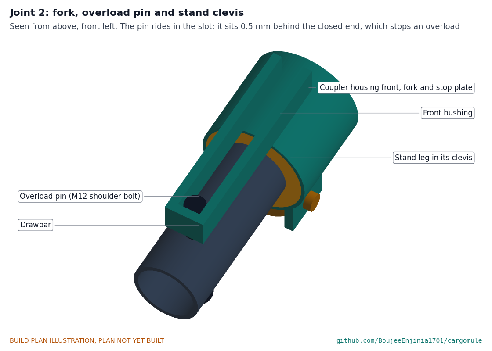

*Figure 3. The overload pin rides in the fork's slot so the drawbar cannot turn, and rests 0.5 mm behind the slot's closed front end so a pull beyond the load cell's range bears on the housing, not on the cell. The stand pivots in its clevis below.*

**Check before moving on.** A 38 mm bar 400 mm long slides through the tube with both bushings in, and the fork slot is square to the tube's top line.

### 3.2 Spring cage and end cap

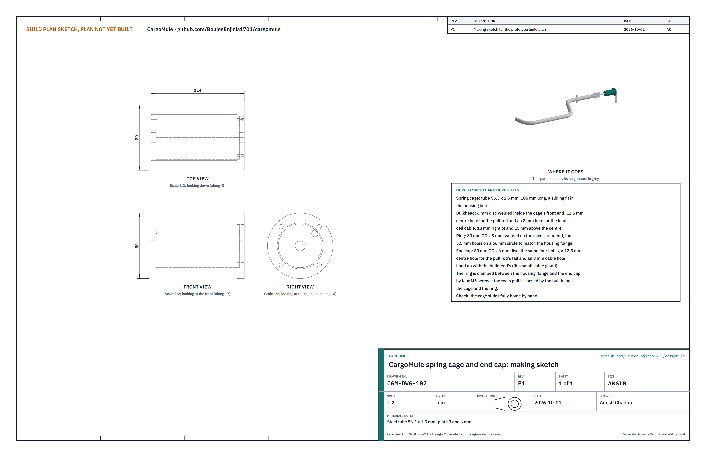

*Figure 4. Spring cage and end cap making sketch (CGM-DWG-102).*

**What it is and what it is made from.** A short tube that slides into the rear of the coupler housing and holds the spring, with a plate across its front end (the bulkhead) for the pull rod to pull on, and the bolted plate that closes the housing. Steel tube 56.3 x 1.5 mm and steel plate 3 and 6 mm.

**How to make it.**

1. Cut 105 mm of 56.3 x 1.5 mm tube. Check it slides into the housing's bore.
2. Bulkhead: a 6 mm disc that fits inside the tube, with a 12.5 mm centre hole and an 8 mm cable hole 18 mm right of and 15 mm above the centre. Weld it inside the tube's front end.
3. Ring: an 80 mm disc 3 mm thick with a 53.3 mm bore and four 5.5 mm holes on a 66 mm circle. Weld it on the tube's rear end.
4. End cap: an 80 mm disc 6 mm thick with the same four holes, a 12.5 mm centre hole and an 8 mm cable hole lined up with the bulkhead's. Fit a small cable gland in the cable hole.

**How it fits the parts next to it.** The cage slides into the housing until its ring meets the housing's flange; the end cap goes on behind the ring and four M5 screws clamp both to the flange (Figure 5). When the bicycle pulls, the pull rod's nut pulls the bulkhead forward, and the cage and ring carry that pull into the housing.

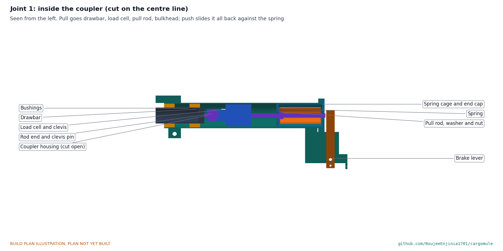

*Figure 5. Inside the coupler, cut on the centre line. A pull goes from the drawbar through the rod end, clevis pin, load cell and pull rod to the nut on the cage's bulkhead. A push above 30 N slides the whole string back against the spring, and the rod's tail pushes the brake lever.*

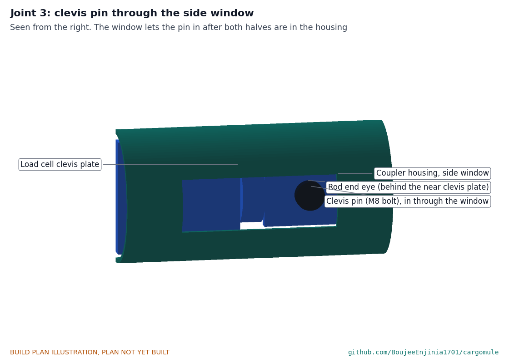

*Figure 6. Through the window in the housing's right side, the M8 clevis pin joins the rod end on the drawbar to the clevis on the load cell.*

**Check before moving on.** The cage slides fully home by hand, and the four holes line up with the flange's.

### 3.3 Dropout plates (make 4)

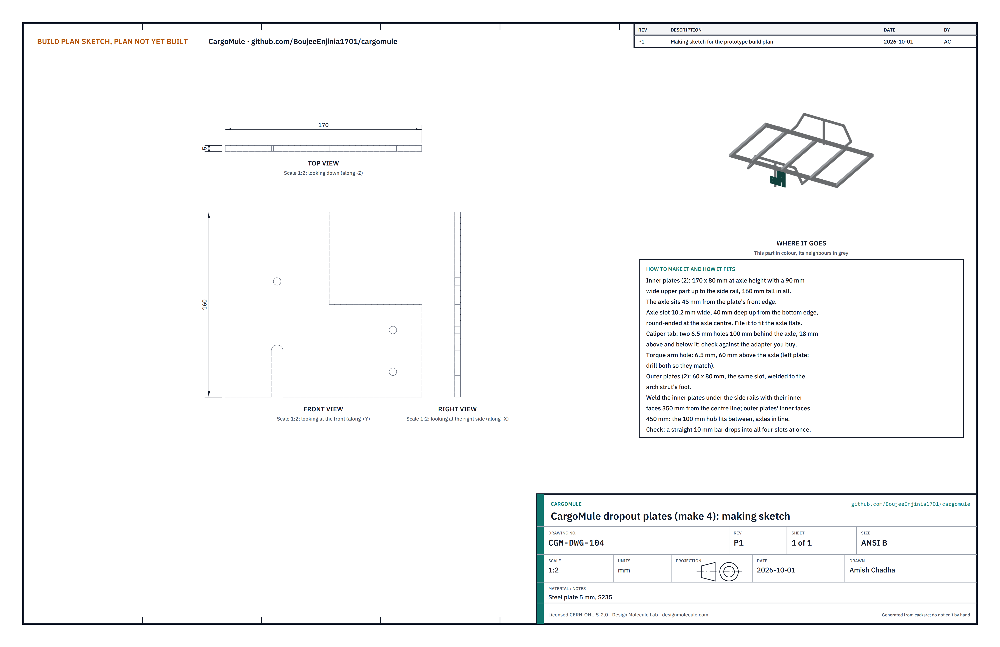

*Figure 7. Dropout plate making sketch (CGM-DWG-104); the left inner plate is drawn.*

**What it is and what it is made from.** The plates that hold the wheel axles. Two inner plates hang under the side rails; two outer plates are welded to the arch frames outside the tyres. The inner plates also carry the brake calipers. Steel plate 5 mm.

**How to make it.**

1. Inner plates (2): cut a 170 x 80 mm piece with a 90 mm wide upper part on top, 160 mm tall in all. The axle centre is 45 mm from the front edge and 40 mm up from the bottom edge.
2. Cut the axle slot 10.2 mm wide from the bottom edge up to the axle centre, with a round end. Check it against the hub motor's axle flats and file it to a sliding fit.
3. Caliper tab: two 6.5 mm holes 100 mm behind the axle, 18 mm above and below it. Check the spacing against the caliper adapter you buy and move the holes to suit.
4. Torque arm hole: 6.5 mm, 60 mm above the axle, in both inner plates (only the left one is used).
5. Outer plates (2): 60 x 80 mm, axle 40 mm up from the bottom edge, the same slot.

**How it fits the parts next to it.** The inner plates' upper edges weld under the side rails with their inner faces 350 mm from the centre line; the outer plates weld to the feet of the arch frames' struts with their inner faces 450 mm from the centre line. The hub's 100 mm locknut faces then sit flat between them (Figures 8 and 9).

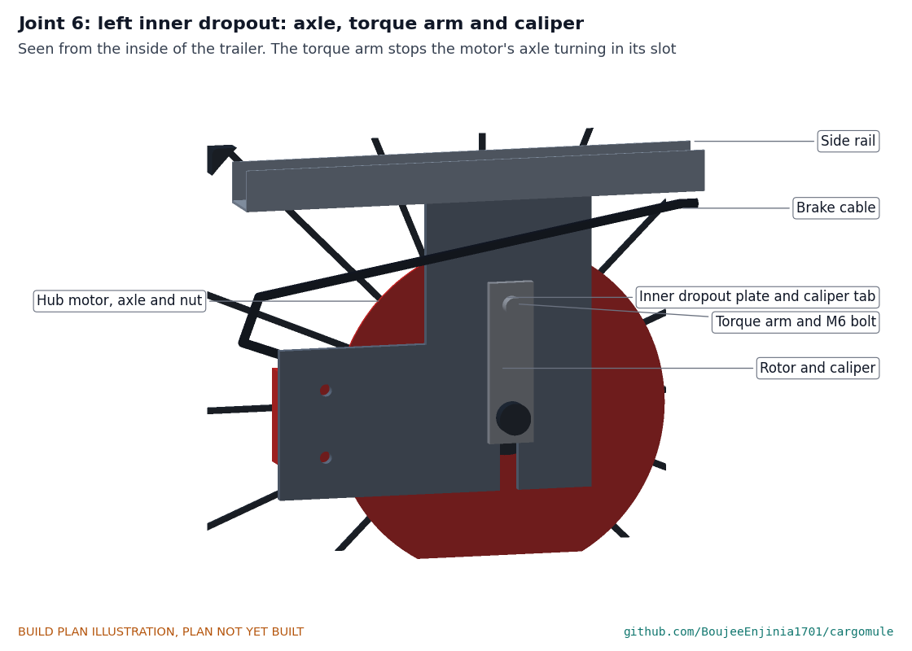

*Figure 8. Left inner dropout from inside the trailer: the axle in its slot, the torque arm on the plate's inside face, and the caliper on its adapter on the tab.*

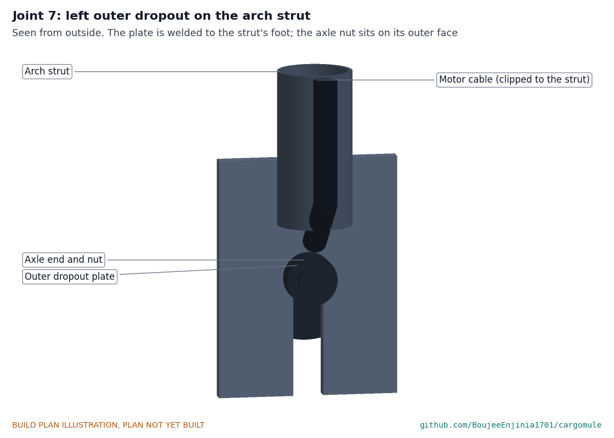

*Figure 9. Left outer dropout on the arch strut's foot, with the axle nut on its outer face and the motor cable clipped up the strut.*

**Check before moving on.** After welding, a straight 10 mm bar drops into both slots of each wheel at once.

### 3.4 Chassis frame

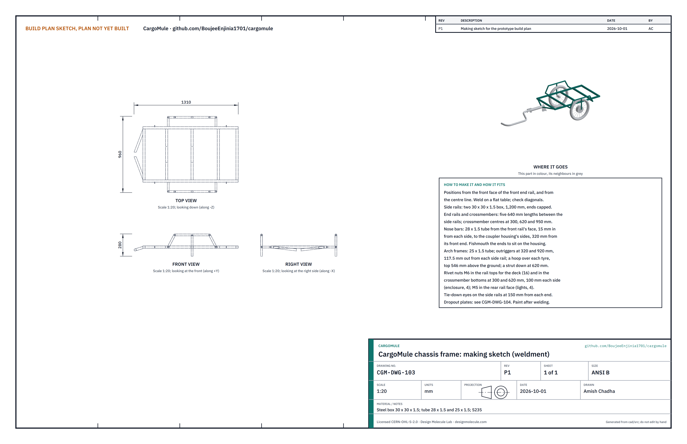

*Figure 10. Chassis frame making sketch (CGM-DWG-103), without the dropout plates.*

**What it is and what it is made from.** The welded frame that everything hangs on: a rectangle of box section with three crossmembers, an A-shaped nose that carries the coupler housing, and an arch frame over each wheel that carries the outer dropout. Steel box section 30 x 30 x 1.5 mm, tube 28 x 1.5 mm and 25 x 1.5 mm, S235 class.

**How to make it.**

1. Cut two side rails 1,200 mm and five pieces 640 mm (the front and rear end rails and three crossmembers). Cap the side rails' open ends with welded plates.
2. On a flat welding table, lay out the rectangle 1,200 x 700 mm outside, with the crossmembers' centres 300, 620 and 950 mm from the front face. Tack, check both diagonals are equal within 2 mm, then weld.
3. Weld the coupler housing on the centre line, on packers: its rear end 50 mm ahead of the front rail's face, its centre line 22 mm below the rails' underside (356 mm above the ground when the trailer stands on its wheels).
4. Nose bars: two 28 x 1.5 mm tubes from the front rail's face, 15 mm in from each side and 15 mm above the rail's bottom, to the sides of the housing 320 mm from its front end. Fishmouth the housing ends to sit on the tube and weld all round.
5. Arch frames: for each side, two outriggers of 25 x 1.5 mm tube at 320 and 920 mm from the front, running out to 467.5 mm from the centre line; a hoop between them rising to 546 mm above the ground over the tyre; and a strut down from the hoop at 620 mm to the outer dropout plate.
6. Weld the dropout plates (section 3.3) with a straight 10 mm bar through all four slots to keep the axles in line.
7. Weld a tie-down eye to each side rail, 150 mm from each end.
8. Fit rivet nuts: 16 M6 in the rail tops for the deck (positions on the deck sketch, section 3.8), 4 M6 in the bottoms of the crossmembers at 300 and 620 mm, 100 mm each side of centre (enclosure), and 4 M5 in the rear rail's face (lights).
9. Grind the welds that face a part, deburr every edge, cap open tube ends and paint.

**How it fits the parts next to it.** The deck lies flat on the rail tops. The enclosure hangs from the two front crossmembers. The housing, nose bars and front rail form one welded nose:

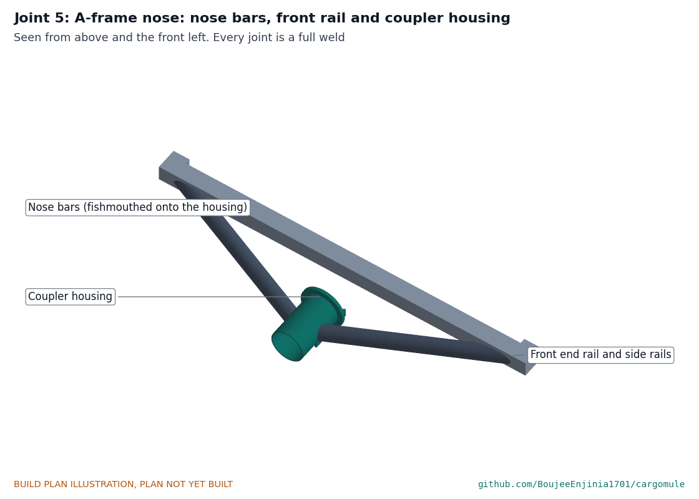

*Figure 11. The nose bars run from the front rail's face to the housing's sides; every joint is a full weld.*

**Check before moving on.** The frame sits flat on the table within 2 mm at all four corners; the diagonals agree within 2 mm; both wheels' slots line up on one axis.

### 3.5 Drawbar

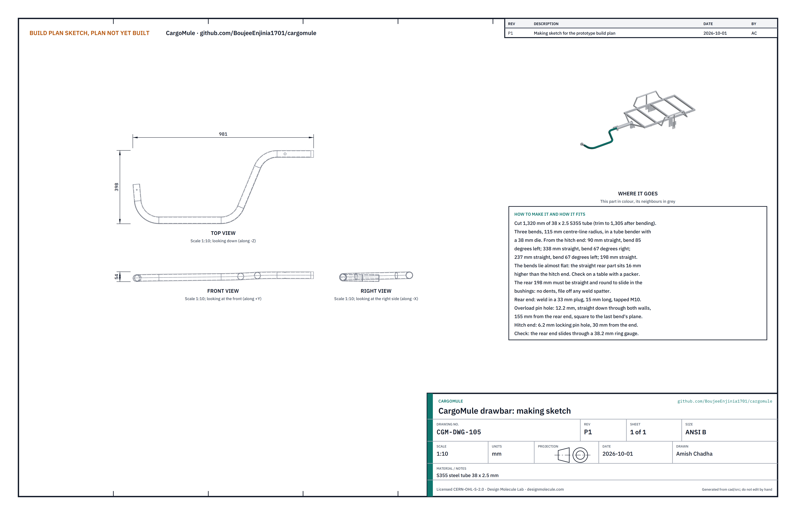

*Figure 12. Drawbar making sketch (CGM-DWG-105).*

**What it is and what it is made from.** The bent tube from the hitch on the bicycle to the coupler. It swings out to the left so it clears the bicycle's rear tyre in a turn, then runs straight down the trailer's centre line into the coupler housing. S355 steel tube 38 x 2.5 mm.

**How to make it.**

1. Cut 1,320 mm of tube. Mark the bend positions from the hitch end.
2. In a tube bender with a 38 mm die and 115 mm centre-line radius: 90 mm straight, bend 85 degrees; 338 mm straight, bend 67 degrees the same way; 237 mm straight, bend 67 degrees back the other way; 198 mm straight to the rear end. Lay it out on the floor to match the top view in Figure 12 before each bend.
3. The three bends lie almost flat. The straight rear part sits 16 mm higher than the hitch end: check on a flat table with a 16 mm packer under the rear part.
4. Trim the rear end square, to 1,305 mm along the centre line in all.
5. Weld a 33 mm steel plug, 15 mm long and tapped M10, flush into the rear end.
6. Overload pin hole: 12.2 mm, straight down through both walls, 155 mm from the rear end, square to the plane of the last bend.
7. Hitch end: a 6.2 mm hole straight down through both walls, 30 mm from the end, for the hitch's locking pin.
8. Dress the straight rear part: it must be round and clean to slide in the bushings, with no dents or spatter.

**How it fits the parts next to it.** The straight rear part slides in the coupler housing's bushings. A rod end screws into its plug, and the overload pin goes through its hole and rides in the fork's slot (Figures 5 and 3). The hitch's arm slides 60 mm into its front end:

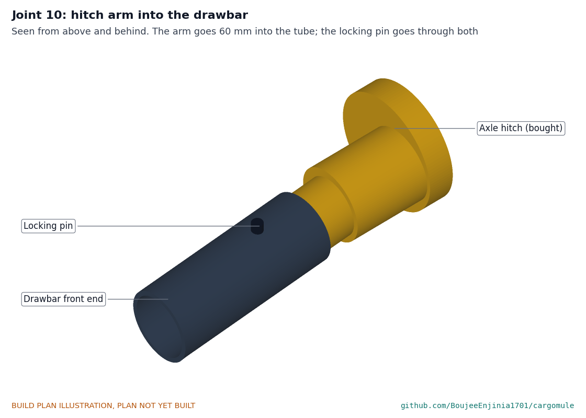

*Figure 13. The hitch's arm goes 60 mm into the drawbar; the locking pin goes through both.*

**Check before moving on.** The rear end passes through a 38.2 mm ring gauge along its whole straight length, and the bends match the drawing on a flat table.

### 3.6 Brake lever

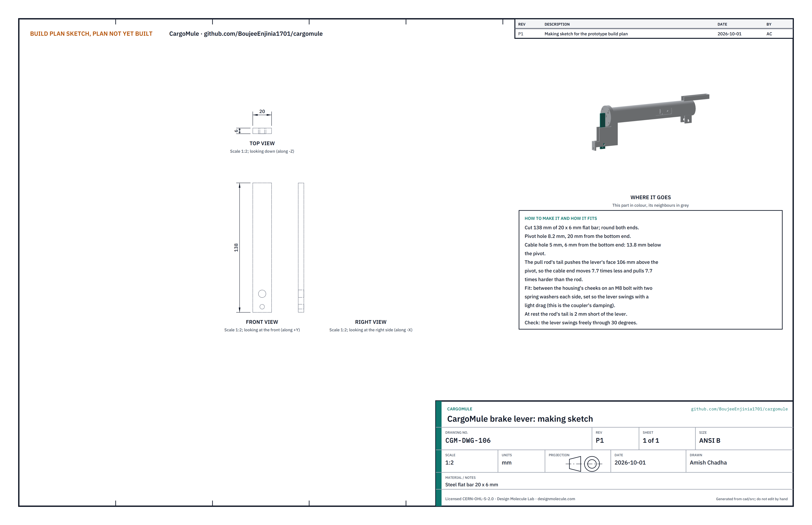

*Figure 14. Brake lever making sketch (CGM-DWG-106).*

**What it is and what it is made from.** The lever that turns the coupler's slide into a pull on the brake cables, 7.7 times harder and 7.7 times shorter. Steel flat bar 20 x 6 mm.

**How to make it.**

1. Cut 138 mm of 20 x 6 mm flat bar and round both ends.
2. Drill the pivot hole 8.2 mm, 20 mm from the bottom end.
3. Drill the cable hole 5 mm, 6 mm from the bottom end (13.8 mm below the pivot).
4. Deburr.

**How it fits the parts next to it.** The lever hangs between the housing's cheeks on an M8 bolt with two spring washers each side, set so it swings with a light drag; that drag is the coupler's damping. The pull rod's tail stops 2 mm short of the lever's face, 106 mm above the pivot. The brake cable's inner wire is clamped in the cable hole and runs back through the stop tab (Figure 15).

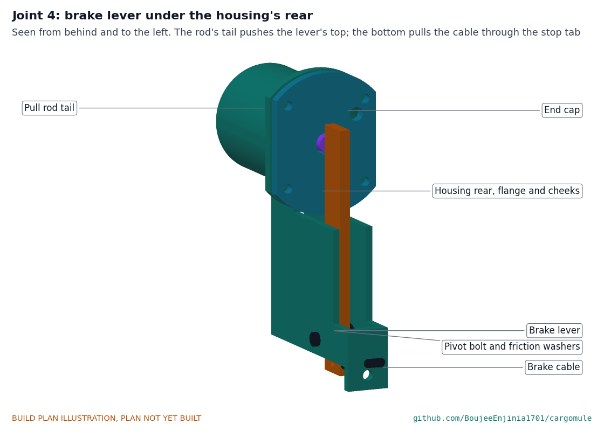

*Figure 15. The rod's tail pushes the lever's top rearward; its bottom pulls the brake cable forward through the stop tab.*

**Check before moving on.** The lever swings freely through 30 degrees on its bolt with a steady light drag.

### 3.7 Parking stand

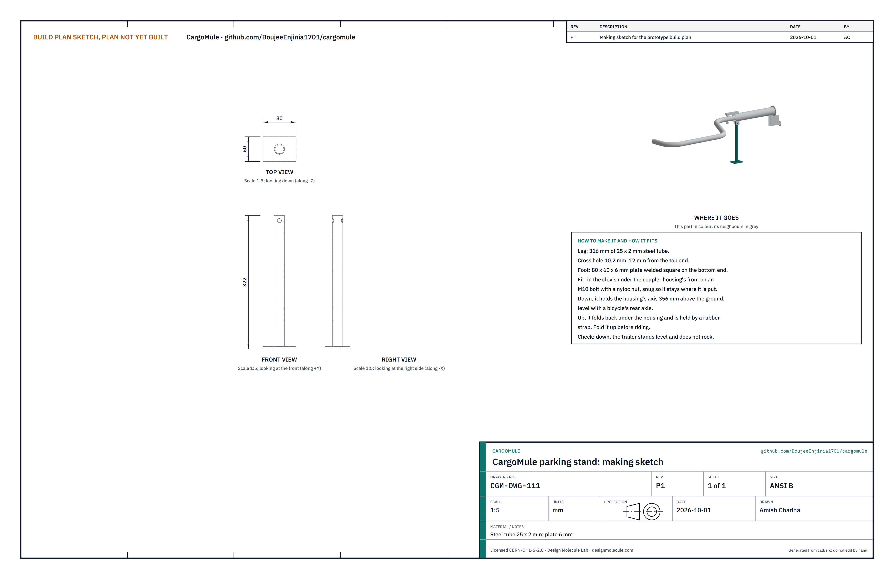

*Figure 16. Parking stand making sketch (CGM-DWG-111).*

**What it is and what it is made from.** A leg that holds the coupler level when the trailer is unhitched. Steel tube 25 x 2 mm and a 6 mm foot plate.

**How to make it.**

1. Cut 316 mm of 25 x 2 mm tube.
2. Drill a 10.2 mm cross hole 12 mm from the top end.
3. Weld an 80 x 60 x 6 mm foot plate square on the bottom end.

**How it fits the parts next to it.** The leg pivots in the clevis under the housing's front on an M10 bolt with a nyloc nut, snug enough to stay where it is put (Figure 3). Down, it holds the housing's centre line 356 mm above the ground. Up, it folds back under the housing and a rubber strap holds it.

**Check before moving on.** With the stand down, the trailer stands level and does not rock.

### 3.8 Deck

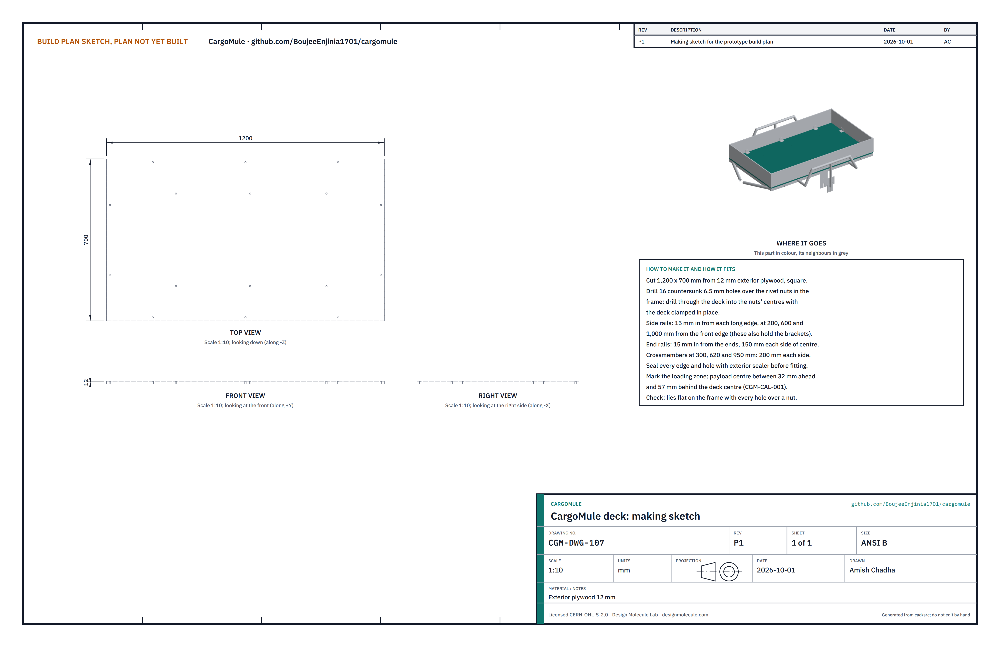

*Figure 17. Deck making sketch (CGM-DWG-107).*

**What it is and what it is made from.** The floor of the load space. Exterior plywood 12 mm.

**How to make it.**

1. Cut 1,200 x 700 mm, square.
2. Clamp it on the frame, flush at the front and both sides, and drill 6.5 mm through it into the centre of each rivet nut: on the side rails 15 mm in from each long edge at 200, 600 and 1,000 mm from the front; on the end rails 15 mm in from each end, 150 mm each side of centre; on the crossmembers at 300, 620 and 950 mm, 200 mm each side of centre. Countersink every hole.
3. Seal every edge and hole with exterior sealer.
4. Paint a loading zone on the top: the load's centre must sit between 32 mm ahead of and 57 mm behind the deck's centre.

**How it fits the parts next to it.** The deck lies flat on the frame's top and is held by 16 M6 countersunk bolts into the rivet nuts. The board brackets share the bolts at the edges (Figure 20).

**Check before moving on.** The deck lies flat with every hole over a rivet nut.

### 3.9 Side and end boards, corner pieces and brackets

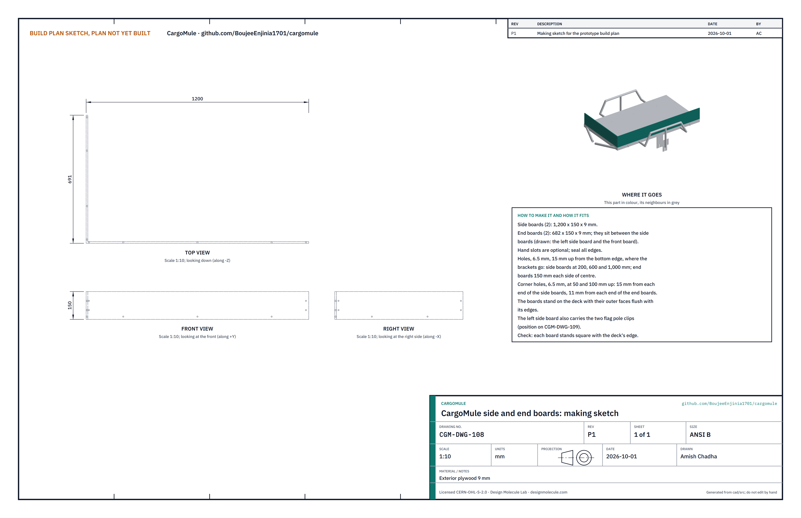

*Figure 18. Side and end boards making sketch (CGM-DWG-108).*

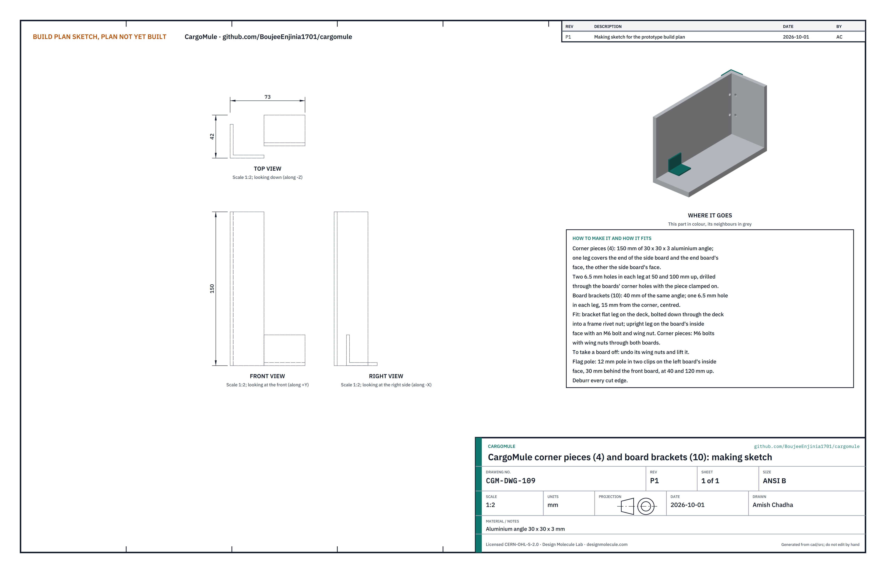

*Figure 19. Corner piece and board bracket making sketch (CGM-DWG-109).*

**What they are and what they are made from.** Four removable boards 150 mm high round the deck, held by aluminium angle corner pieces and brackets. Exterior plywood 9 mm; aluminium angle 30 x 30 x 3 mm.

**How to make them.**

1. Side boards (2): 1,200 x 150 mm. End boards (2): 682 x 150 mm. Seal all edges.
2. Bracket holes, 6.5 mm, 15 mm up from the bottom edge: side boards at 200, 600 and 1,000 mm from the front end; end boards 150 mm each side of centre.
3. Corner holes, 6.5 mm, at 50 and 100 mm up: 15 mm from each end of the side boards, 11 mm from each end of the end boards.
4. Corner pieces (4): 150 mm of angle; clamp each on its corner and drill two 6.5 mm holes in each leg through the boards' corner holes.
5. Brackets (10): 40 mm of angle, one 6.5 mm hole in each leg, 15 mm from the corner, centred.
6. Deburr every cut.

**How they fit the parts next to them.** The boards stand on the deck with their outer faces flush with its edges. Each bracket's flat leg is bolted down through the deck into a rivet nut, and its upright leg holds the board with an M6 bolt and a wing nut on the inside. Each corner piece wraps the corner outside and is bolted through both boards with wing nuts. The flag pole sits in two clips on the left board's inside face, 30 mm behind the front board, at 40 and 120 mm above the deck.

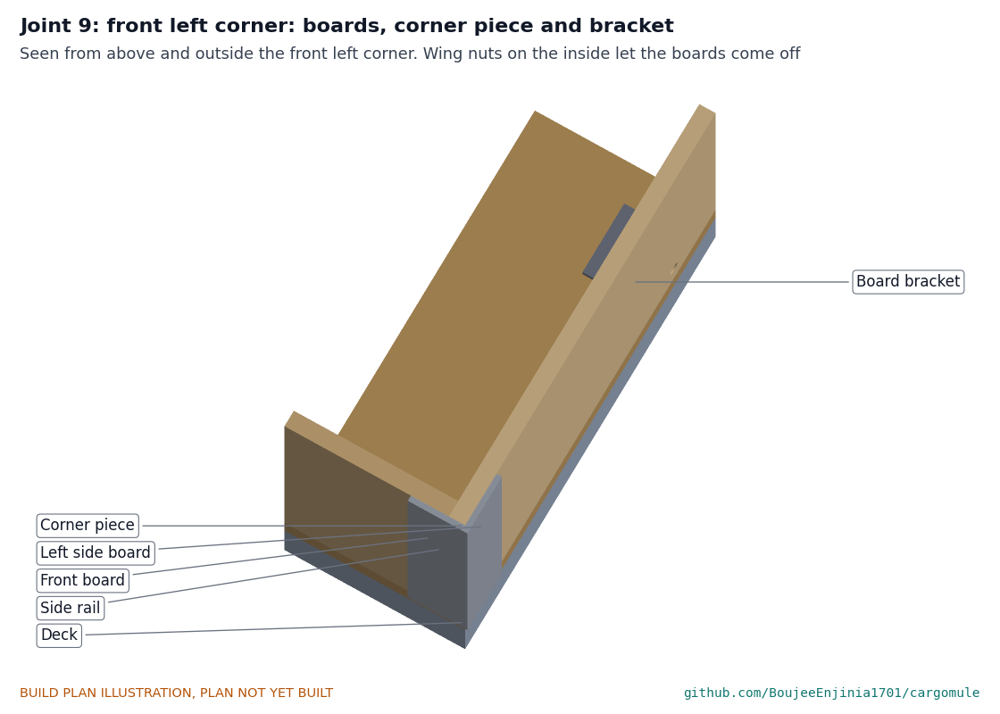

*Figure 20. Boards, corner piece and bracket at the front left corner.*

**Check before moving on.** Each board stands square to the deck edge, and every wing nut can be reached from inside the load space.

### 3.10 Battery enclosure and door

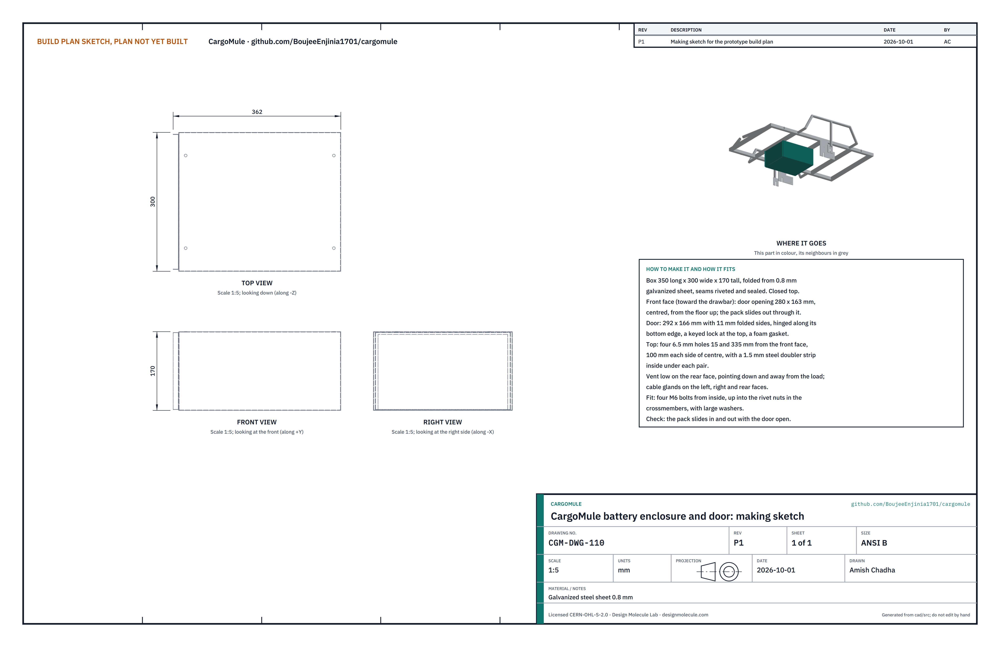

*Figure 21. Battery enclosure and door making sketch (CGM-DWG-110).*

**What it is and what it is made from.** A closed steel box under the front of the deck for the battery pack, motor controller and control board, with a lockable door on its front face. Galvanized steel sheet 0.8 mm.

**How to make it.**

1. Fold the box 350 long x 300 wide x 170 mm tall from 0.8 mm sheet, with a closed top and bottom. Rivet and seal the seams.
2. Front face (toward the drawbar): cut a 280 x 163 mm door opening, centred, from the floor up.
3. Door: 292 x 166 mm with 11 mm folded sides; hinge it along its bottom edge; fit a keyed lock at its top and a foam gasket round the opening.
4. Top: four 6.5 mm holes, 15 and 335 mm from the front face, 100 mm each side of centre. Rivet a 1.5 mm steel doubler strip inside under each pair.
5. Fit a vent low on the rear face, pointing down and away from the load, and cable glands in the left wall (motor cable), right wall (load cell cable) and rear wall (light cables).

**How it fits the parts next to it.** The box's top sits flat under the crossmembers at 300 and 620 mm from the frame's front, held by four M6 bolts from inside into the rivet nuts, with large washers (Figure 22). The controller and control board are screwed to its floor on the right; the pack sits on a rubber mat on the left and is strapped down; it slides out forward through the door, under the deck.

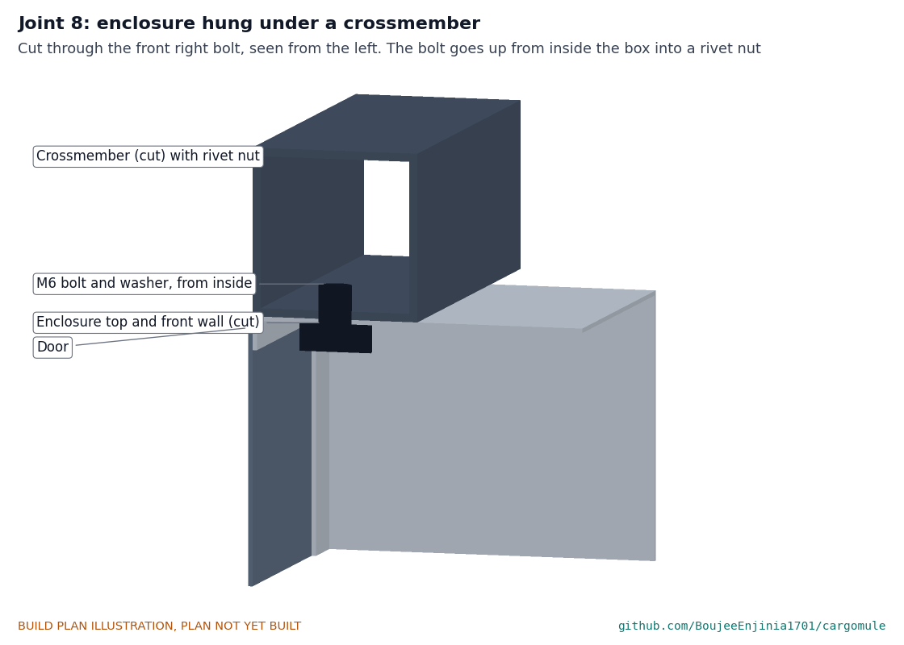

*Figure 22. Cut through the front right enclosure bolt: the bolt goes up from inside the box into a rivet nut in the crossmember.*

**Check before moving on.** The door closes and locks over its gasket; an empty pack case slides in and out through the door.

### 3.11 Bought components and what to do to them

Buy to specification, not brand. Line numbers are those of the bill of materials.

- **Axle hitch (line 4).** Clamps under the bicycle's left rear axle end (9 mm quick release or 12 mm thru-axle with the matching hitch axle), a joint that allows pitch, yaw and roll, a 32 mm arm with a 6 mm locking pin and a visible lock indicator, and a safety strap rated 3.9 kN or more.
- **Load cell (line 5).** S-type, 1 kN, 2 mV/V, IP66, M10 threads at both ends, no more than 54 mm across its diagonal; an M10 rod end with a spherical eye; a clevis that screws onto the cell with an M8 pin; an HX711-class amplifier, potted in the enclosure.
- **Coupler parts (line 6).** Two acetal bushings 38 mm bore, 56.3 mm outside, 25 mm long (or turn them from 60 mm acetal rod); an M10 pull rod about 180 mm long with a 40 mm spring seat washer and nut; a compression spring about 40 mm outside, 96 mm free length, giving about 30 N where fitted and under 40 mm solid; an M12 shoulder bolt with a nyloc nut for the overload pin; a brake cable splitter (one in, two out) and three brake cables.
- **Hub motor wheel (line 7).** 36 V 250 W geared front-style hub, 100 mm spacing, disc mount, 10 mm axle flats, cable exit on the non-disc side, laced in a 20 in rim; a torque arm to suit.
- **Idler wheel (line 8).** 20 in wheel with a 100 mm disc hub.
- **Disc brakes (line 9).** Two cable calipers with 180 mm rotors, metallic pads and post-mount adapters. Fit each rotor on its hub at the bench with its six screws and threadlocker, with the rotor on the side that faces the trailer's centre.
- **Pack, controller, board, harness (lines 11 to 14).** As the bill of materials. The harness has keyed waterproof connectors, so the pack and each cable unplug.
- **Lights, reflectors and flag (line 15).** Two rear lights, side reflectors, a 12 mm flag pole and two pole clips.
- **Fixings (line 18).** 20 M6 and 4 M5 rivet nuts; M6 countersunk bolts for the deck; M6 bolts and wing nuts for the boards; M5 screws for the end cap and lights; M8 and M10 bolts with nyloc nuts for the lever, clevis pin and stand; cable clips and ties.

## 4. Putting it together

In each picture the parts already fitted are grey and the parts being fitted are in colour, with an arrow showing the way they go in. Work with the frame on two trestles about 500 mm high until step 12.

### Step 1: bushings into the coupler housing

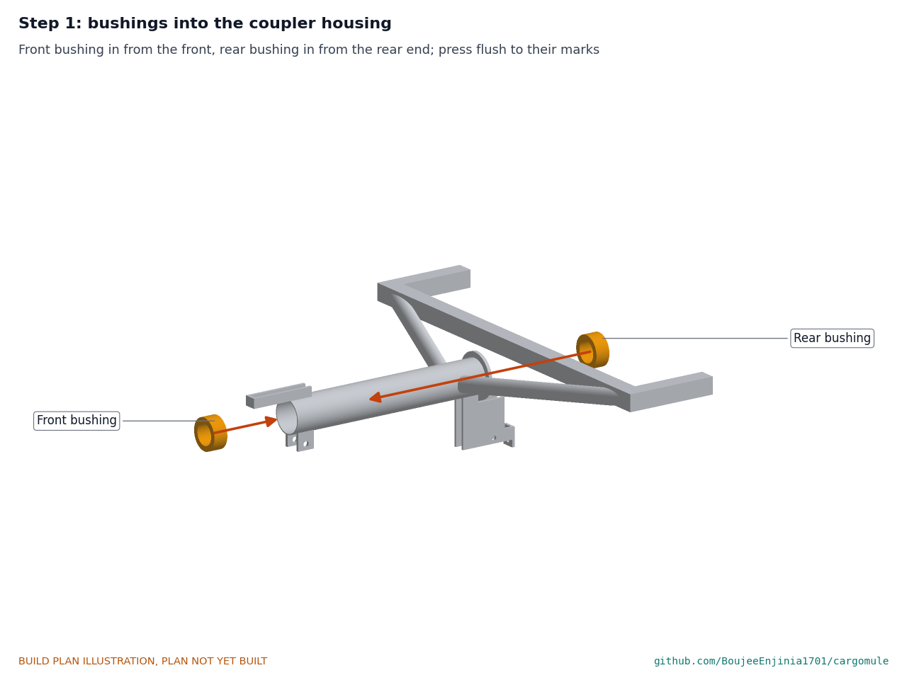

Press the front bushing into the housing's front end until flush, and the rear bushing in from the rear end until it sits 60 to 85 mm from the front end (mark the depth on a rod). A light smear of grease on the bore.

### Step 2: drawbar in from the front, then the overload pin

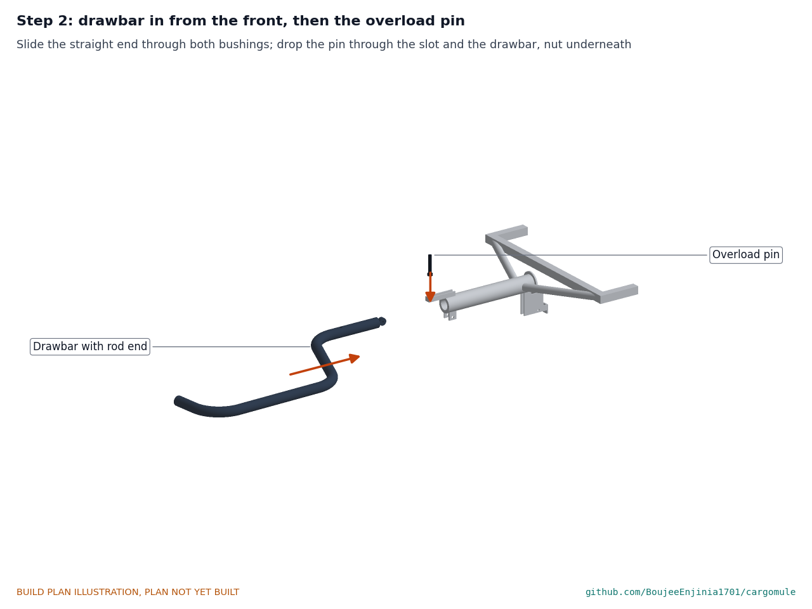

Screw the rod end into the drawbar's plug with threadlocker, eye upright. Slide the drawbar's straight end into the front of the housing through both bushings until its pin hole lines up under the fork's slot. Drop the M12 shoulder bolt through the slot and the drawbar and fit its nyloc nut underneath.

### Step 3: load cell cartridge in from the rear, then the end cap

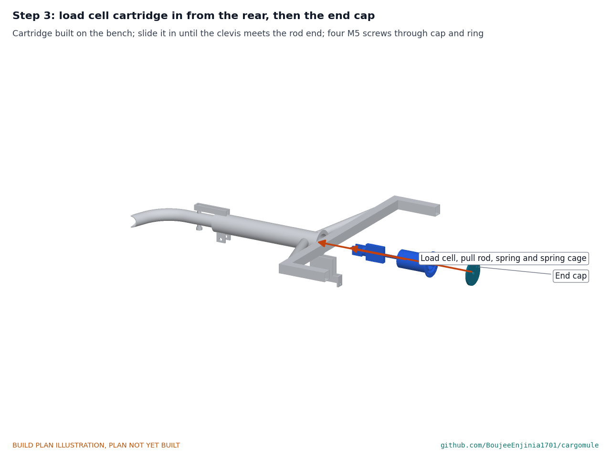

At the bench, screw the clevis onto the load cell's front thread and the pull rod into its rear thread, both with threadlocker; thread the cell's cable alongside. Pass the rod through the cage's bulkhead, fit the spring seat washer and nut, set the spring behind them and feed the cable through the bulkhead's cable hole. Slide the whole cartridge into the housing's rear until the clevis meets the rod end; fit the end cap over the rod's tail and the cable, and clamp cap and ring to the flange with four M5 screws. **Hold point:** the overload pin must rest 0.5 mm behind the slot's front end (check with a 0.5 mm feeler gauge); if not, take the end cap off and move the nut on the pull rod.

### Step 4: clevis pin through the side window

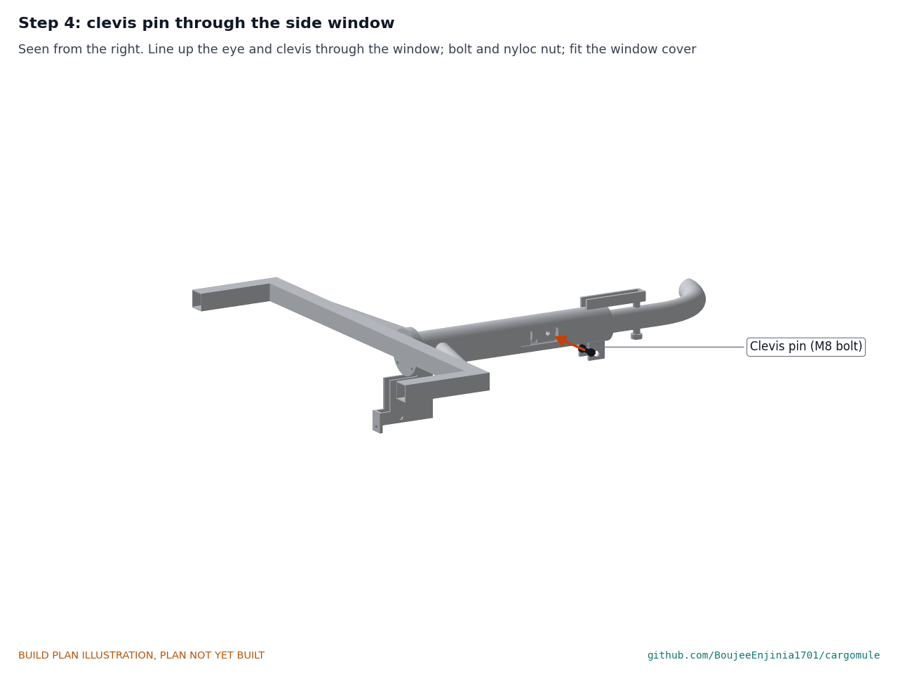

Seen from the right. Line up the rod end's eye between the clevis plates through the window and fit the M8 bolt and nyloc nut, snug. Fit the rubber window cover.

### Step 5: brake lever onto its cheeks

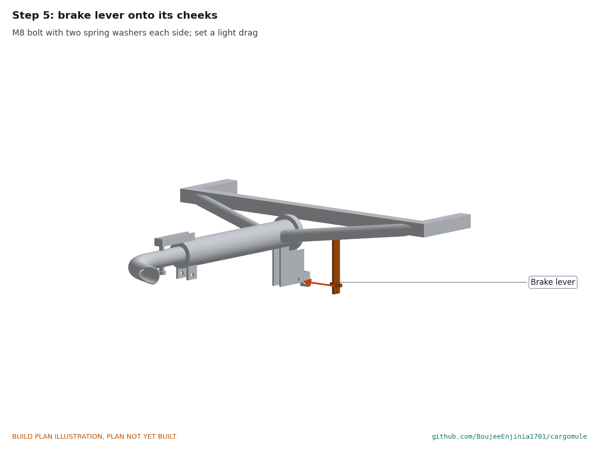

M8 bolt through the cheeks and lever, two spring washers each side of the lever, nyloc nut; tighten until the lever swings with a light, even drag. Check there is a 2 mm gap between the rod's tail and the lever.

### Step 6: parking stand into its clevis

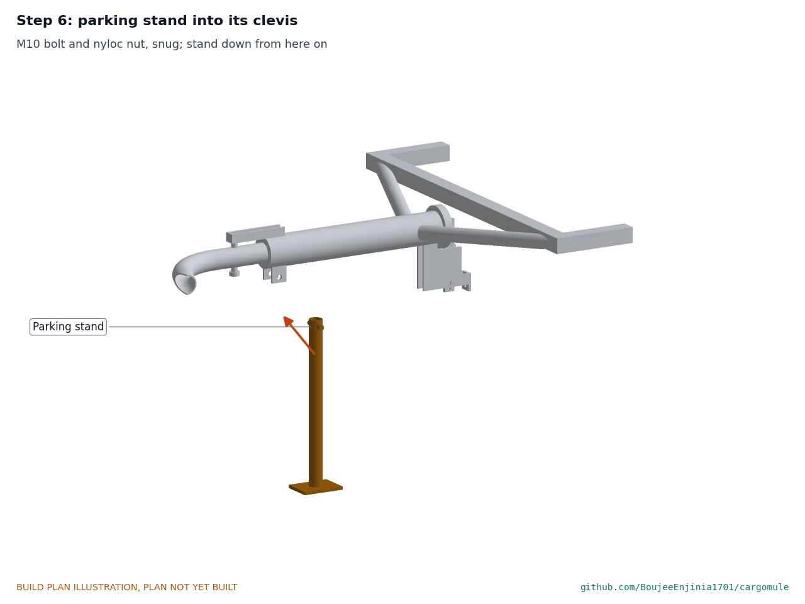

M10 bolt and nyloc nut, snug. Use the stand from here on whenever the trailer is off the trestles.

### Step 7: wheels into the dropouts

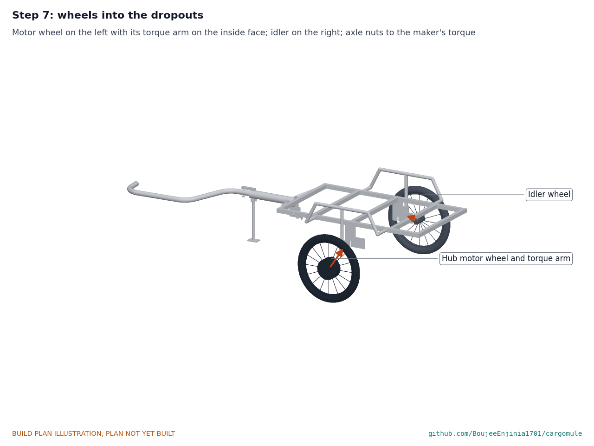

Rotors already on the hubs (section 3.11). Lift each wheel up into its slots from below: the motor wheel on the left with its cable on the outside, the idler on the right. On the motor wheel, fit the torque arm over the axle flats on the inner plate's inside face and bolt it to the plate. Tighten the axle nuts and quick-release to the makers' torque.

### Step 8: calipers onto the dropout tabs

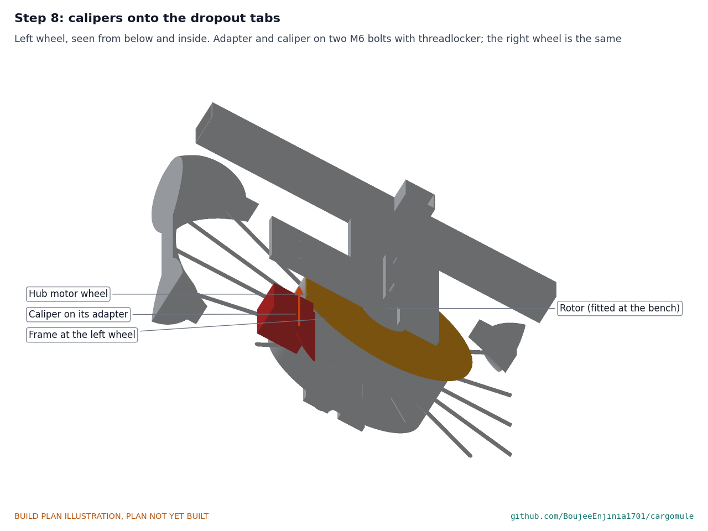

Seen from below. Bolt each adapter to its tab with two M6 bolts and threadlocker, then the caliper to the adapter, centred over the rotor. Spin each wheel: the rotor must not touch the pads.

### Step 9: brake cables and splitter

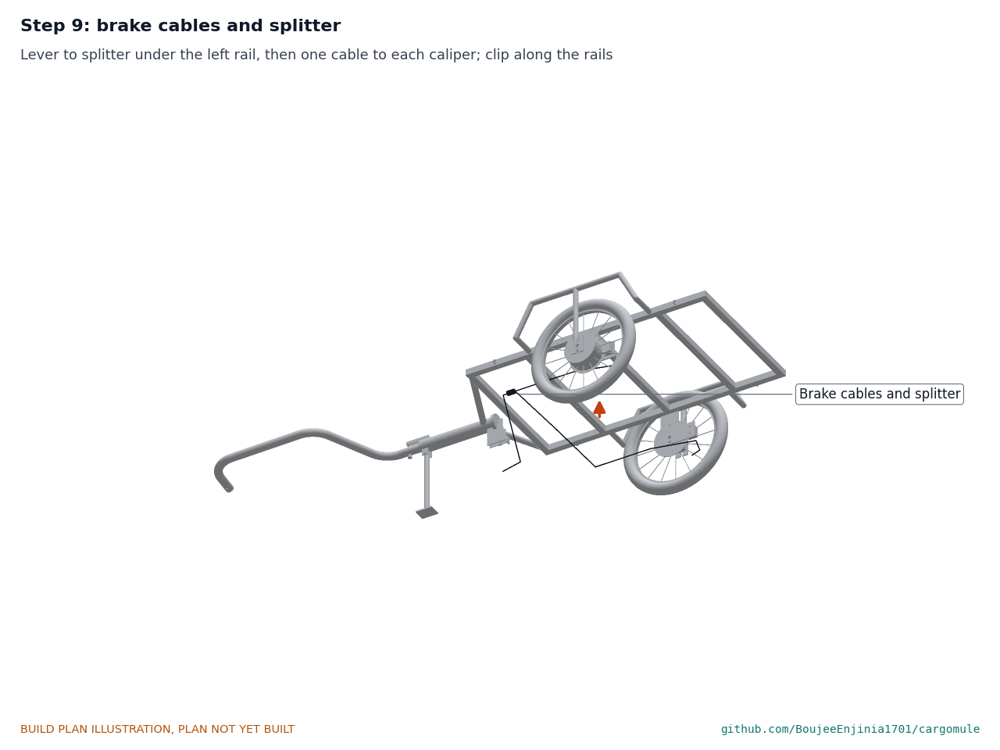

Clamp the input cable's inner wire in the lever's cable hole with its outer against the stop tab, and run it to the splitter clipped under the left rail. Run one cable from the splitter along each side rail to its caliper, clipped every 200 mm. Adjust so the calipers start to bite when the lever's top has moved about 3 mm.

### Step 10: enclosure under the crossmembers

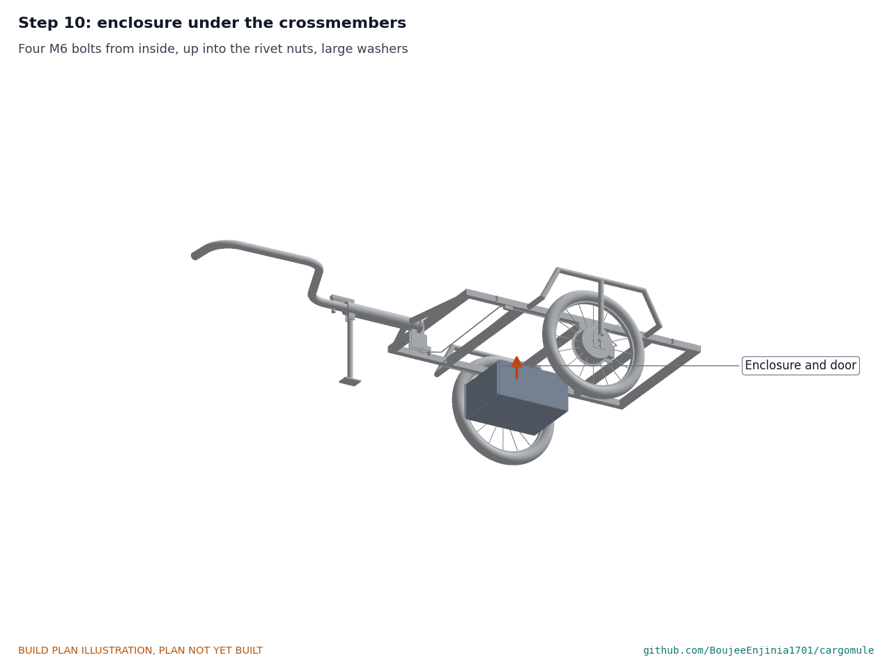

Seen from below. Hold the box up under the two crossmembers and fit the four M6 bolts from inside with large washers, through the open door.

### Step 11: controller, control board and harness

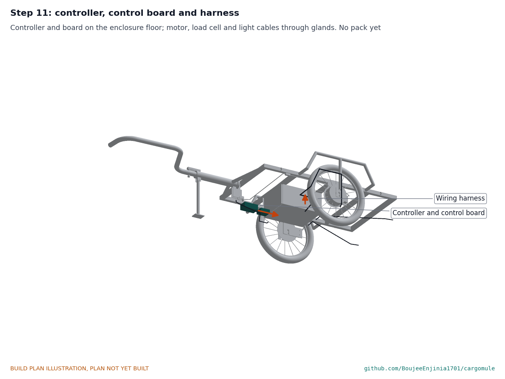

Screw the controller and the control board to the enclosure floor on the right, leaving the left free for the pack. Run the motor cable from the motor's axle up the arch strut, along the arch frame and the left rail into the enclosure's left gland; the load cell cable from the end cap's gland under the deck to the right gland; the light cables from the rear gland to each rear light. Clip every cable to the frame, clear of the wheels and of the drawbar's 50 mm slide. **Hold point:** no pack yet; every connector checked against the harness maker's wiring diagram.

### Step 12: deck onto the frame

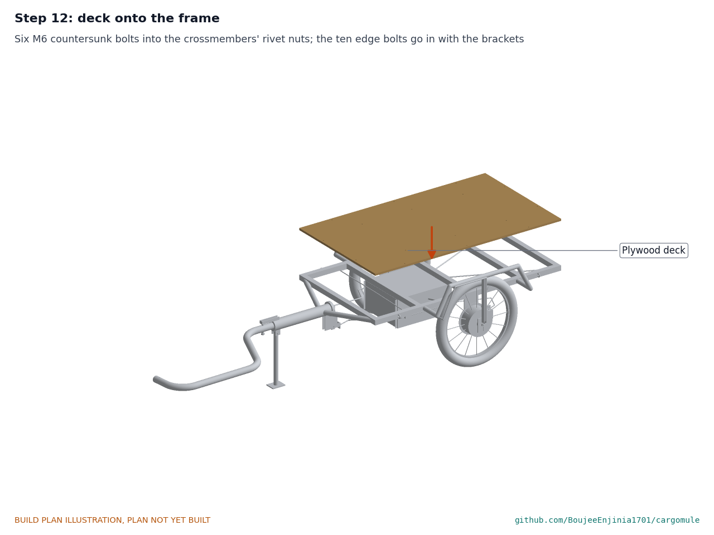

Lift the trailer off the trestles onto its wheels and stand. Lay the deck on the frame and fit six M6 countersunk bolts into the crossmembers' rivet nuts. The other ten holes, along the edges, take the bracket bolts in step 13.

### Step 13: boards, corner pieces and brackets

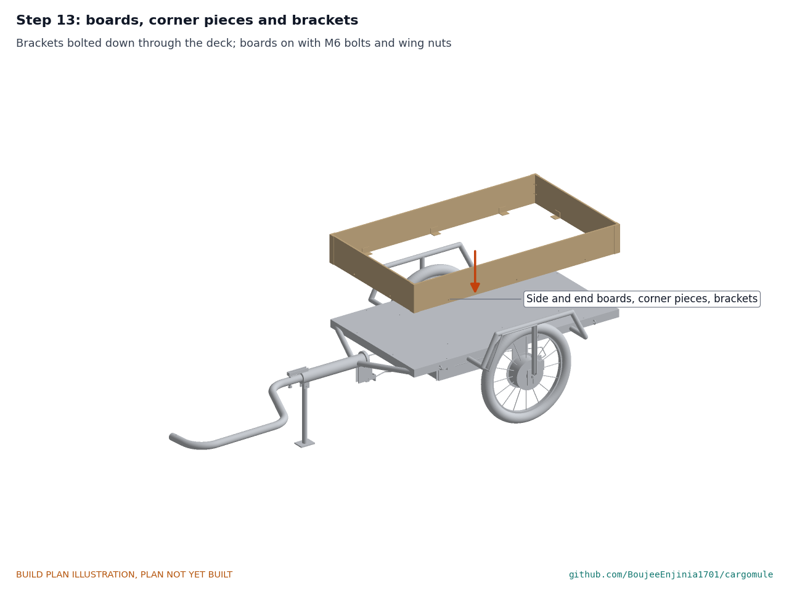

Bolt the ten brackets down through the deck into their rivet nuts. Stand the boards on the deck against the brackets and fit the M6 bolts and wing nuts; then the corner pieces with their wing nuts.

### Step 14: lights, reflectors and flag

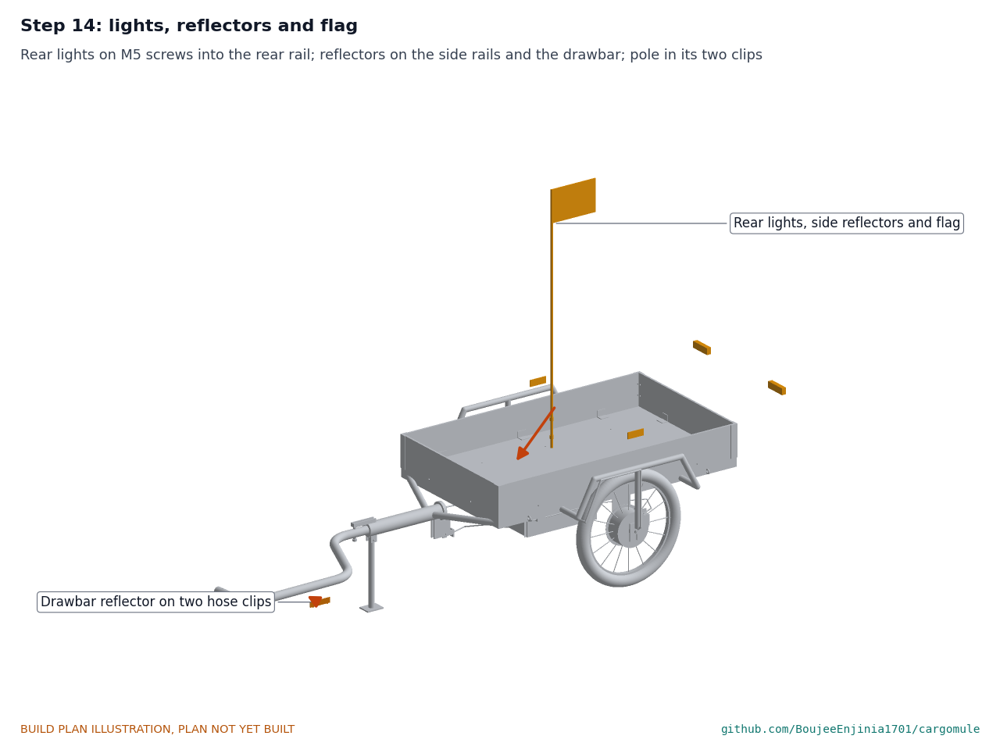

Rear lights on M5 screws into the rear rail's rivet nuts; plug in their cables. Side reflectors on the side rails' outer faces. Flag pole into its two clips.

### Step 15: battery pack into the enclosure

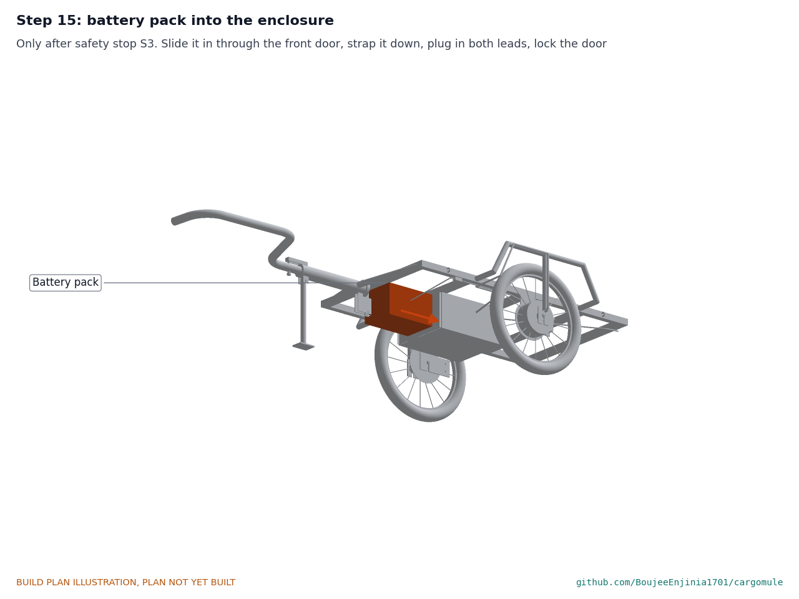

Seen from below with the deck left out. **Only after safety stop S3.** Slide the pack in through the door onto its mat, strap it down, plug it in, fit the fuse, close and lock the door.

### Step 16: hitch onto the bicycle and into the drawbar

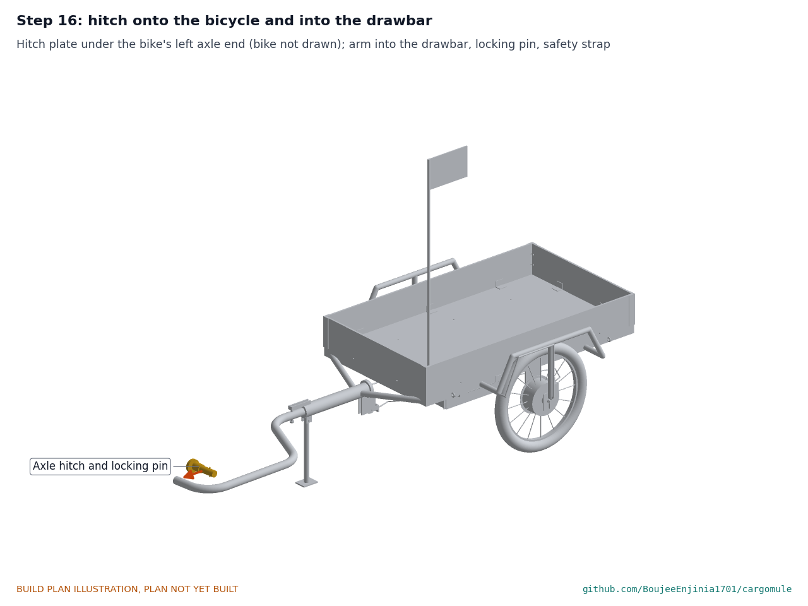

The bicycle is not drawn. Fit the hitch under the bicycle's left rear axle end as its maker describes. Lift the drawbar's front end, slide it over the hitch's arm, fit the locking pin and check the lock indicator, and fit the safety strap round the bicycle's chainstay. Fold the stand up. **Hold point:** safety stop S5.

## 5. First checks

These are the checks a TRL 4 test report would record; this plan only lists them. Requirement numbers are those of CGM-REQ-001.

*Table 2. First checks.*

| Check | Requirement | How | Pass when |
| --- | --- | --- | --- |
| Coupler slides | R6 | Trailer on its stand, bike unhitched; push the drawbar back by hand with a spring balance | It starts to move at about 30 N, slides 50 mm smoothly and springs back; no binding |
| Brakes apply on overrun | R6 | Push the drawbar back with the wheels lifted; turn each wheel by hand | Both wheels lock before 50 mm of slide; each rotor runs free at rest |
| Brake gain | R6 | Spring balance on the drawbar against a known brake torque at each wheel | About 7.8 N of braking force at the tyres per N of push above the preload, dry |
| Overload stop | R1, R13 | Pull the drawbar forward against a fixed hitch with a spring balance or load cell | The pin meets the slot's end with 0.5 mm of travel; the cell's reading stops rising there |
| Load cell reads both ways | R4, R6 | Amplifier output while pulling and pushing the drawbar by hand at 10 to 40 N | Reading follows the force in both directions within 1 N, and returns to zero |
| Assist cut on push | R6, R13 | Bench supply in place of the pack, motor wheel lifted; command assist, then push the drawbar | Motor current falls to zero within 100 ms of 20 N of push |
| Assist only in tension | R5 | Wheel lifted; no pull, then pull above 3 N | No motor current without pull; current rises in proportion to pull |
| Fault cut | R13 | Unplug the load cell while assisting | Motor current zero within 100 ms; the brakes still work |
| Articulation | R7, R9 | Hitched to a bicycle, swing the trailer through a turn both ways | The drawbar clears the rear tyre to about 55 degrees toward the drawbar side |
| Hitch load | R10 | Bathroom scale under the hitch with 150 kg of sandbags centred in the loading zone | 3 to 10 kg (7.5 kg estimated) |
| Mass | R8 | Weigh the empty trailer with the pack | 47 kg or less, the prototype cap (46.2 kg estimated) |
| Size | R9 | Tape measure | 1,000 mm or less wide; 2.6 m or less from the bicycle's axle |
| Lights and flag | R14 | Look; measure the flag's top | Lights on from the pack; flag top 1.5 m or more above the ground |

## 6. Safety stops

Stop at each point. Carry on only when everything listed is true.

- **S1. Before any welding.** The area is clear of anything that burns; a fire extinguisher is in reach; the welder wears a helmet, gloves and leathers; nobody else watches the arc unprotected. No welding on the frame once the pack, controller or harness are fitted.
- **S2. Before the tube bender is used.** The bender is bolted down; hands are clear of the die; the tube is supported at its free end.
- **S3. Before the pack comes into the workshop.** The pack's voltage is 36 to 43 V and its case is undamaged and dry; a charging spot is ready on a non-combustible surface with a fire extinguisher for electrical fires within reach; the 20 A fuse is out; every connector has been checked for polarity with a meter, not by wire colour.
- **S4. Before the motor first turns.** The motor wheel is off the ground; hands, cables and clothing are clear of the spokes; the assist cut on push and the fault cut (section 5) pass with a current-limited bench supply in place of the pack.
- **S5. Before the trailer is hitched or loaded.** Every bolt is tight with its nut or threadlocker; the overload pin and clevis pin are in; both brakes lock on a push of the drawbar with the power off; the hitch's lock indicator shows locked and the safety strap is on; the stand is up.
- **S6. Before the first loaded roll.** On private, level ground only, at walking pace, with the load strapped down inside the loading zone. Never on a public road: its legal status is not settled.
- **S7. Charging.** Only with the charger on the bill of materials, on the charging spot, attended, never below 0 °C and never with a damaged or wet pack.

## 7. Tools, skills and workspace

**Tools.** Metal-cutting bandsaw or chop saw and hacksaw; tube bender with a 38 mm die and 115 mm centre-line radius (or a fabricator's bender); MIG or stick welder for 1.5 to 6 mm steel; angle grinder with cutting, grinding and flap discs; bench drill and hand drill; drills 3 to 12.5 mm; M5 and M10 taps; step drill; files, deburring tool and a 56 mm hone or flap wheel for the housing's bore; rivet nut tool for M5 and M6; sheet metal folder or bending brake for 0.8 mm sheet 350 mm long, aviation snips and a pop rivet tool; circular saw or jigsaw for plywood; welding table or flat floor area 1.5 x 1 m; two trestles about 500 mm high; spirit level, steel rule, tape, square, calipers and a 0.5 mm feeler gauge; spanners and sockets 8 to 19 mm; torque wrench; spring balance to 200 N; multimeter; bench power supply with a current limit (0 to 45 V, 0 to 5 A); bathroom scale; crimper and wire strippers.

**Skills.** Steel fabrication and welding of thin-wall tube, tube bending, sheet folding, bicycle brake and wheel fitting, and low-voltage wiring with plug-in connectors. The welding should be done or checked by a competent welder. All circuits on the trailer are extra-low voltage (43.8 V at most on charge); the charger is a certified unit and no mains wiring is part of this build.

**Workspace.** A workshop area about 3 x 2 m with a welding corner kept apart from the electrical bench; ventilation for welding fumes and paint; the charging spot of S3.

**Personal protective equipment.** Welding helmet, gloves and leathers; safety glasses for cutting, grinding and drilling; hearing protection for sawing and grinding; cut-resistant gloves for sheet metal; safety boots when lifting the frame; no gloves near a turning drill.

## 8. Where the numbers come from

- Model and constructability checks: `cad/src/model.py` (`python cad/src/model.py --check`, 73 checks); STEP and STL exports in `cad/step/` and `cad/stl/`.
- Pictures: `cad/src/build_plan_media.py`, using `.kit/build_views.py`; written to `docs/05-build-plan/` and `cad/drawings/CGM-DWG-101` to `CGM-DWG-111`.
- General arrangement: `cad/drawings/CGM-DWG-001.pdf`, Rev P4.
- Calculations: `docs/04-calcs/01-sizing.md` (CGM-CAL-001 v0.3) and `docs/04-calcs/sizing.py`: masses [A1] to [A3], hitch load and loading zone [A6], [A7], brake gain and push [F3], [F4], drawbar strength [G3], [G4], articulation [H5].
- Bill of materials: `bom/bom.csv`.
- Decisions: `docs/decisions/0003-design-for-construction.md` (CGM-DDR-003), with CGM-DDR-001 and CGM-DDR-002.
- Requirements: `docs/03-requirements.md` (CGM-REQ-001 v0.5).
